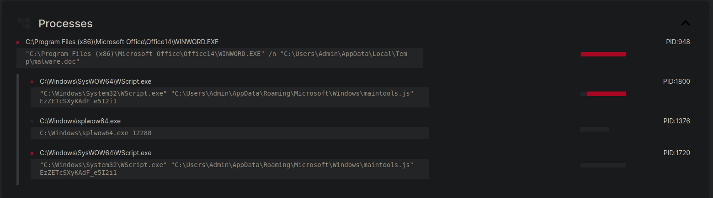
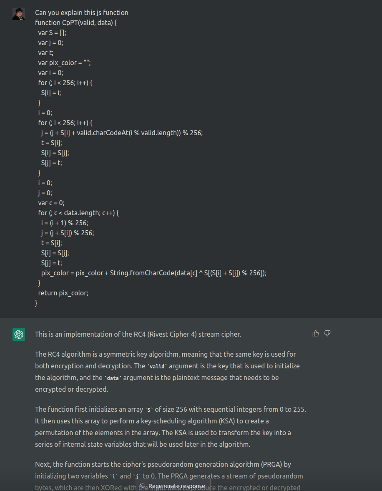

https://cyberdefenders.org/blueteam-ctf-challenges/76

## Scenario
>During your shift as a SOC analyst, the enterprise EDR alerted a suspicious behavior from an end-user machine. The user indicated that he received a recent email with a DOC file from an unknown sender and passed the document for you to analyze.

---
## Tools
- https://github.com/decalage2/oletools
- https://github.com/decalage2/ViperMonkey
- https://github.com/DidierStevens/DidierStevensSuite
- https://tria.ge
- https://gchq.github.io/CyberChef/
- http://www.jsnice.org/
- https://chat.openai.com

When downloading the challenge we are presented with a ZIP archive `c58-js-backdoor.zip` which contains a file called `49b367ac261a722a7c2bbbc328c32545` 
In a case where we did not know the file format the linux `file` command could be used like so.
```
╭─ ~/Downloads ────────────────────────────────────────────────────────────────────────────────────────────────────────────────────────────────────────────────────────────────────────── ✔ │  mwcfg │ 17:10:50 
╰─ file 49b367ac261a722a7c2bbbc328c32545 
49b367ac261a722a7c2bbbc328c32545: Composite Document File V2 Document, Little Endian, Os: Windows, Version 6.1, Code page: 1252, Author: user, Template: Normal.dotm, Last Saved By: John, Revision Number: 11, Name of Creating Application: Microsoft Office Word, Total Editing Time: 08:00, Create Time/Date: Fri Nov 25 19:04:00 2016, Last Saved Time/Date: Fri Nov 25 20:04:00 2016, Number of Pages: 1, Number of Words: 320, Number of Characters: 1828, Security: 0
```
This indicates to us that it is a MIcrosoft Office Word document. I will rename the file to `49b367ac261a722a7c2bbbc328c32545.doc` in order to be able to open it and view it's contents in a Microsoft Office Word compatible editor.

**Question #1 - What is the sha256 hash of the doc file?**

Using the `sha256sum` tool in linux
```
╭─ ~/Downloads ────────────────────────────────────────────────────────────────────────────────────────────────────────────────────────────────────────────────────────────────────────── ✔ │  mwcfg │ 17:15:10 
╰─ sha256sum 49b367ac261a722a7c2bbbc328c32545.doc 
ff2c8cadaa0fd8da6138cce6fce37e001f53a5d9ceccd67945b15ae273f4d751  49b367ac261a722a7c2bbbc328c32545.doc
```

**Question #2 - Multiple streams contain macros in this document. Provide the number of lowest one.**

This can be answered using DiederStevens tool `oledump` 
```
╭─ ~/Downloads ───────────────────────────────────────────────────────────────────────────────────────────────────────────────────────────────────────────────────────────────────────────────────────────────────────────────────────────────────────────────── ✔ │  mwcfg │ 17:16:24 
╰─ python ../tools/DidierStevensSuite/oledump.py 49b367ac261a722a7c2bbbc328c32545.doc 
  1:       114 '\x01CompObj'
  2:       284 '\x05DocumentSummaryInformation'
  3:       392 '\x05SummaryInformation'
  4:      8017 '1Table'
  5:      4096 'Data'
  6:       483 'Macros/PROJECT'
  7:        65 'Macros/PROJECTwm'
  8: M    7117 'Macros/VBA/Module1'
  9: m    1104 'Macros/VBA/ThisDocument'
 10:      3467 'Macros/VBA/_VBA_PROJECT'
 11:      2964 'Macros/VBA/__SRP_0'
 12:       195 'Macros/VBA/__SRP_1'
 13:      2717 'Macros/VBA/__SRP_2'
 14:       290 'Macros/VBA/__SRP_3'
 15:       565 'Macros/VBA/dir'
 16:        76 'ObjectPool/_1541577328/\x01CompObj'
 17: O   20301 'ObjectPool/_1541577328/\x01Ole10Native'
 18:      5000 'ObjectPool/_1541577328/\x03EPRINT'
 19:         6 'ObjectPool/_1541577328/\x03ObjInfo'
 20:    133755 'WordDocument'
```
The M indicates a stream that contains a VBA macro. In this case 8 would be the lowest stream.

**Question #3 - What is the decryption key of the obfuscated code?**

There are multiple ways to find the answer to this question.
Firstly by using the tool `olevba` on the document and adding the decode and deobfuscation option.
This will decode common encoding types in the VBA macro and attempt to deobfuscate the VBA as much as possible.
```
╭─ ~/Downloads ─────────────────────────────────────────────────────────────────────────────────────────────────────────────────────────────────────────────────────────────────────────────────────────────────────────────────────────────────────────────── ✘ 2 │  mwcfg │ 17:28:33 
╰─ olevba 49b367ac261a722a7c2bbbc328c32545.doc --decode --deobf
```
olevba will highlight functionality it deems important within the document
```
+----------+--------------------+---------------------------------------------+
|Type      |Keyword             |Description                                  |
+----------+--------------------+---------------------------------------------+
|AutoExec  |AutoOpen            |Runs when the Word document is opened        |
|AutoExec  |AutoClose           |Runs when the Word document is closed        |
|Suspicious|Environ             |May read system environment variables        |
|Suspicious|Open                |May open a file                              |
|Suspicious|Put                 |May write to a file (if combined with Open)  |
|Suspicious|Binary              |May read or write a binary file (if combined |
|          |                    |with Open)                                   |
|Suspicious|Kill                |May delete a file                            |
|Suspicious|Shell               |May run an executable file or a system       |
|          |                    |command                                      |
|Suspicious|WScript.Shell       |May run an executable file or a system       |
|          |                    |command                                      |
|Suspicious|Run                 |May run an executable file or a system       |
|          |                    |command                                      |
|Suspicious|CreateObject        |May create an OLE object                     |
|Suspicious|Windows             |May enumerate application windows (if        |
|          |                    |combined with Shell.Application object)      |
|Suspicious|Xor                 |May attempt to obfuscate specific strings    |
|          |                    |(use option --deobf to deobfuscate)          |
|Suspicious|Base64 Strings      |Base64-encoded strings were detected, may be |
|          |                    |used to obfuscate strings (option --decode to|
|          |                    |see all)                                     |
|Suspicious|VBA obfuscated      |VBA string expressions were detected, may be |
|          |Strings             |used to obfuscate strings (option --decode to|
|          |                    |see all)                                     |
|IOC       |maintools.js        |Executable file name                         |
|Base64    |'3\x13+C$_\x17|MxOH8pcrlepD3SRfF5ffVTy86Xe41L2qLnqTd5d5R7Iq8|
|String    |U<wԽ.zwyG*\|7mWGES55fswgG84hIRdX74dlb1SiFOkR1Hh          |
|          |x18D0o8]_\x1d|                                             |
|          |RSGQ'          |                                             |
|VBA string|%appdata%\Microsoft\|Environ("appdata") & "\Microsoft\Windows"    |
|          |Windows             |                                             |
|VBA string|%appdata%           |Environ("appdata")                           |
|VBA string|\maintools.js       |"\" & "maintools.js"                         |
|VBA string|"                   |"""" + " EzZETcSXyKAdF_e5I2i1"               |
|          |EzZETcSXyKAdF_e5I2i1|                                             |
+----------+--------------------+---------------------------------------------+
```

In this case we can see a new file being mentioned in the VBA macro named `maintools.js` further below another VBA string is decoded `EzZETcSXyKAdF_e5I2i1`. It looks like the `maintools.js` file is taking this suspicious string as an command-line argument. This suspicious string is the decryption key for the obfuscated code within `maintools.js`. 
Secondly this can also be confirmed by running the word document within a sandbox such as https://tria.ge . Another individual previously uploaded the document for analysis on this platform https://tria.ge/220629-y7vjgscfdr/behavioral1


Here we see the document dropping the `maintools.js` file and running i with the suspect decryption key as a command-line argument.

Finally this can also be statically deobfucated from the VBA macro itself.
In the below VBA macro snippet we can see that the `OBKHLrC3vEDjVL` string variable is being run by WScript and taking our suspected decryption key as an argument.
The `OBKHLrC3vEDjVL` variable is defined as so `OBKHLrC3vEDjVL = B8qen2T433Ds1bW & "\" & "maintools.js"` and `B8qen2T433Ds1bW` is defined as so `B8qen2T433Ds1bW = Environ("appdata") & "\Microsoft\Windows"`
This will make the file execute from the following folderpath `%appdata%\Microsoft\Windows`, just as we see in the sandbox analysis.
```vb
B8qen2T433Ds1bW = Environ("appdata") & "\Microsoft\Windows"
Set R7Ks7ug4hRR2weOy7 = CreateObject("Scripting.FileSystemObject")
If Not R7Ks7ug4hRR2weOy7.FolderExists(B8qen2T433Ds1bW) Then
B8qen2T433Ds1bW = Environ("appdata")
End If
Set R7Ks7ug4hRR2weOy7 = Nothing
Dim K764B5Ph46Vh
K764B5Ph46Vh = FreeFile
OBKHLrC3vEDjVL = B8qen2T433Ds1bW & "\" & "maintools.js"
Open (OBKHLrC3vEDjVL) For Binary As #K764B5Ph46Vh
Put #K764B5Ph46Vh, 1, Wk4o3X7x1134j
Close #K764B5Ph46Vh
Erase Wk4o3X7x1134j
Set R66BpJMgxXBo2h = CreateObject("WScript.Shell")
R66BpJMgxXBo2h.Run """" + OBKHLrC3vEDjVL + """" + " EzZETcSXyKAdF_e5I2i1"
```

**Question #4 - What is the name of the dropped file?**

This was already answered in the previous questions `maintools.js`
The dropped file can be downloaded from a sandbox like the one metioned above.
It is also possible to use a non sandbox method to extract the dropped js file from the VBA, although i did not take the hard approach.

**Question #5 - This script uses what language?**

As the file name indicates it is `JScript`
Beautification of the script was done via http://www.jsnice.org/ and unticking the 'Infer types' option.

**Question #6 - What is the name of the variable that is assigned the command-line arguments?**

`var wvy1 = WScript.Arguments;` the variables name is `wvy1`

**Question #7 - How many command-line arguments does this script expect?**

The previously defined variable is used here `var ssWZ = wvy1(0);` WScript.Arguments is 0 indexed as seen here https://ss64.com/vb/arguments.html 
Which means that it starts counting from 0 so 0 means 1 argument is expected.

**Question #8 - What instruction is executed if this script encounters an error?**

The JS is just running a regular try...catch statement and on a error the catch statement runs `WScript.Quit();`
```JavaScript
} catch (e) {
  WScript.Quit();
}
```

**Question #9 - What function returns the next stage of code (i.e. the first round of obfuscated code)?**

At the very bottom of the encrypted text blob the return statement is seen `return qGxZ;`
The funtion that contains the encrypted text blob and also contains the return statement is the `function y3zb()` 

**Question #10 - The function LXv5 is an important function, what variable is assigned a key string value in determining what this function does?**

The functions argument is also quite telling, but the variable assigned a key string is `var LUK7 = "ABCDEFGHIJKLMNOPQRSTUVWXYZabcdefghijklmnopqrstuvwxyz0123456789+/";`
This contains the entire valid base64 character set except `=` which is just used as padding anyways.

**Question #11 - What encoding scheme is this function responsible for decoding?**

As mentioned above the encoding scheme is `Base64`

**Question #12 - In the function CpPT, the first two for loops are responsible for what important part of this function?**

This question can be answered using two methods.
One is knowing encryption algorithm constants. Which would quickly point you to https://en.wikipedia.org/wiki/RC4
Where the KSA section contains pseudocode that looks similar to what this function implements.

The other way to answer this question is using ChatGPT to explain the function to us.

It will even explain the KSA(`key-scheduling Algorithm`) to you, which is the answer to the question.

**Question #13 - The function CpPT requires two arguments, where does the value of the first argument come from?**

Looking at the initial try...catch statement in the file, we can see that it takes the decryption key in as it's first argument. This is the same key from the `WScript.Arguments` input. This is also known as the `command-line argument` being provided to the Wscript.exe file.
```JS
try {
  var wvy1 = WScript.Arguments;
  var ssWZ = wvy1(0);
  var ES3c = y3zb();
  ES3c = LXv5(ES3c);
  ES3c = CpPT(ssWZ, ES3c);
  eval(ES3c);
```

**Question #14 - For the function CpPT, what does the first argument represent?**

As discussed previously this argument represents the decryption `key`

**Question #15 - What encryption algorithm does the function CpPT implement in this script?**

As we previously found out, this function is implementing the `RC4` symmetric encryption cipher.

**Question #16 - What function is responsible for executing the deobfuscated code?**

```JS
  ES3c = LXv5(ES3c);
  ES3c = CpPT(ssWZ, ES3c);
  eval(ES3c);
```
Here we can see the base64 decoding followed by RC4 decryption of the text blob and then the final execution of the decrypted text blob with the `eval()` function.
https://developer.mozilla.org/en-US/docs/Web/JavaScript/Reference/Global_Objects/eval

**Question #17 - What Windows Script Host program can be used to execute this script in command-line mode?**

```
There are two versions of the Windows Script Host: a Windows-based version (Wscript.exe), which provides a property sheet for setting script properties, and a command-prompt-based version (Cscript.exe), which provides command-line switches for setting script properties. You can run either of these by typing Wscript.exe or Cscript.exe at the command prompt.
```
https://learn.microsoft.com/en-us/previous-versions/windows/it-pro/windows-server-2003/cc738350(v=ws.10)
`Cscript.exe`

**Question #18 - What is the name of the first function defined in the deobfuscated code?**

The encrypted text blob is decoded and decrypted using the following CyberChef recipe.
`[{"op":"From Base64","args":["A-Za-z0-9+/=",true,false]},{"op":"RC4","args":[{"option":"UTF8","string":"EzZETcSXyKAdF_e5I2i1"},"Latin1","Latin1"]}]`
The recipe is just reimplementing what the JS code is doing, by first Base64 decoding the text blob and then RC4 decrypting it with the decryption key `EzZETcSXyKAdF_e5I2i1`
```JS
'use strict';
function UspD(path) {
  var bs = WScript.CreateObject("ADODB.Stream");
  bs.Type = 2;
  bs.CharSet = "437";
  bs.Open();
  bs.LoadFromFile(path);
  var what = bs.ReadText;
  bs.Close();
  return cz_b(what);
}
```
The resulting second stage JS first defined function is `UspD`