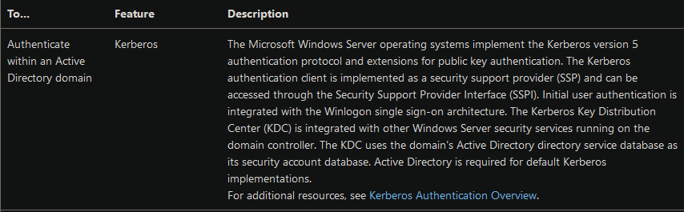
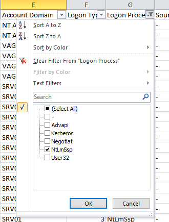
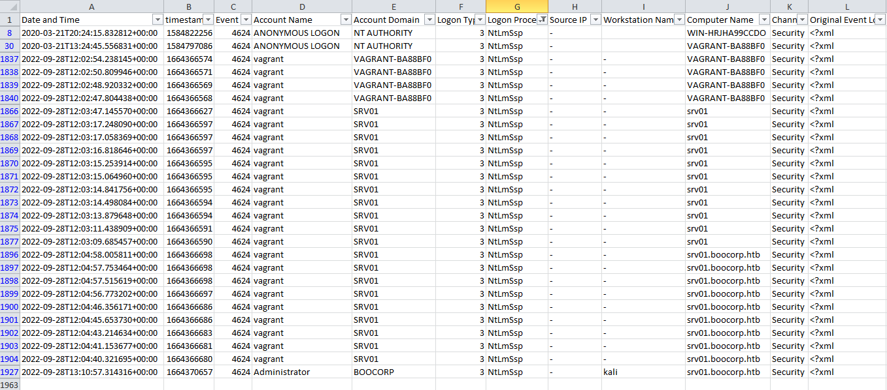
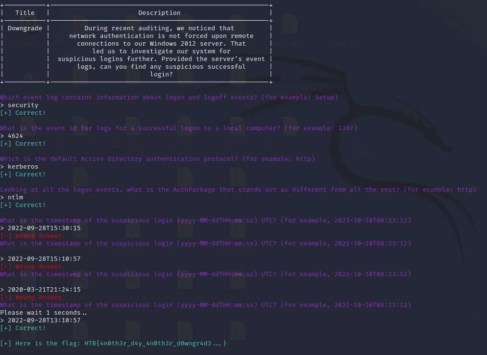

## CHALLENGE INFO
> During recent auditing, we noticed that network authentication is not forced upon remote connections to our Windows 2012 server.
> That led us to investigate our system for suspicious logins further.
> Provided the server's event logs, can you find any suspicious successful login?

---
## Tools
https://github.com/ahmedkhlief/APT-Hunter

**Question #1: Which event log contains information about logon and logoff events? (for example: Setup)**
https://www.ultimatewindowssecurity.com/securitylog/book/page.aspx?spid=chapter5
*Logon/Logoff events in the Security log correspond to the _Audit logon events_ policy category, which comprises nine subcategories. As the name implies, the Logon/Logoff category’s primary purpose is to allow you to track all logon sessions for the local computer.*
`Security`

**Question #2: What is the event id for logs for a successful logon to a local computer? (for example: 1337)**
https://www.ultimatewindowssecurity.com/securitylog/encyclopedia/event.aspx?eventID=4624
*4624: An account was successfully logged on*
`4624`

**Question #3: What is the default Active Directory authentication protocol? (for example: http)**
https://learn.microsoft.com/en-us/windows-server/security/windows-authentication/windows-authentication-overview

`Kerberos`

**Question #4: Looking at all the logon events, what is the AuthPackage that stands out as different from all the rest? (for example: http)**
We can see a lot of expected Authentication protocols that are expected to occur within AD. NTLM however is interesting and need further investigation.

`NTLM`

**Question #5: What is the timestamp of the suspicious login (yyyy-MM-ddTHH:mm:ss) UTC? (for example, 2021-10-10T08:23:12)**
You can find the suspicious login using Windows built in event log viewer and filtering with it's xml feature with the following query.
```XML
<QueryList>
  <Query Id="0" Path="file://C:\Users\CTF\Desktop\Security.evtx">
    <Select Path="file://C:\Users\CTF\Desktop\filtered.evtx">*[System[(EventID=4624)]] and *[EventData[Data[@Name='AuthenticationPackageName'] = 'NTLM']]</Select>
    <Suppress Path="file://C:\Users\CTF\Desktop\filtered.evtx">*[EventData[Data[@Name='TargetUserName'] = 'vagrant']]</Suppress>
  </Query>
</QueryList>
```
https://techcommunity.microsoft.com/t5/ask-the-directory-services-team/advanced-xml-filtering-in-the-windows-event-viewer/ba-p/399761
https://www.bomzan.com/2016/09/01/advanced-xml-filering-in-the-windows-event-viewer/
https://social.technet.microsoft.com/wiki/contents/articles/51866.windows-event-viewer-custom-view-to-exclude-user-account.aspx
https://serverfault.com/questions/1006298/what-time-zone-does-windows-event-logs-show
You can also find the suspicious login more easily using APT-Hunter like so.
```PowerShell
PS C:\ProgramData\Microsoft\Windows\Start Menu\Programs\Tools\Forensic> .\APT-Hunter.exe -p C:\Users\CTF\Desktop\Security.evtx

  /$$$$$$  /$$$$$$$  /$$$$$$$$         /$$   /$$                       /$$
 /$$__  $$| $$__  $$|__  $$__/        | $$  | $$                      | $$
| $$  \ $$| $$  \ $$   | $$           | $$  | $$ /$$   /$$ /$$$$$$$  /$$$$$$    /$$$$$$   /$$$$$$
| $$$$$$$$| $$$$$$$/   | $$    /$$$$$$| $$$$$$$$| $$  | $$| $$__  $$|_  $$_/   /$$__  $$ /$$__  $$
| $$__  $$| $$____/    | $$   |______/| $$__  $$| $$  | $$| $$  \ $$  | $$    | $$$$$$$$| $$  \__/
| $$  | $$| $$         | $$           | $$  | $$| $$  | $$| $$  | $$  | $$ /$$| $$_____/| $$
| $$  | $$| $$         | $$           | $$  | $$|  $$$$$$/| $$  | $$  |  $$$$/|  $$$$$$$| $$
|__/  |__/|__/         |__/           |__/  |__/ \______/ |__/  |__/   \___/   \_______/|__/

                                                                By : Ahmed Khlief , @ahmed_khlief
                                                                Version : 2.0

Analyzing C:\Users\CTF\Desktop\Security.evtx
Time Sketch Report saved as _TimeSketch.csv
Logon Events Report saved as _Logon_Events.csv
APT-Hunter.py:265: FutureWarning: Use of **kwargs is deprecated, use engine_kwargs instead.
Report saved as _Report.xlsx
```
The output generates a csv file containing logon events, that i then filter for NTLM logons. This results in the following result where the suspicious logon is clear.

```XML
- <Event xmlns="http://schemas.microsoft.com/win/2004/08/events/event">
- <System>
  <Provider Name="Microsoft-Windows-Security-Auditing" Guid="{54849625-5478-4994-a5ba-3e3b0328c30d}" /> 
  <EventID>4624</EventID> 
  <Version>1</Version> 
  <Level>0</Level> 
  <Task>12544</Task> 
  <Opcode>0</Opcode> 
  <Keywords>0x8020000000000000</Keywords> 
  <TimeCreated SystemTime="2022-09-28T13:10:57.3143161Z" /> 
  <EventRecordID>18636</EventRecordID> 
  <Correlation /> 
  <Execution ProcessID="488" ThreadID="2112" /> 
  <Channel>Security</Channel> 
  <Computer>srv01.boocorp.htb</Computer> 
  <Security /> 
  </System>
- <EventData>
  <Data Name="SubjectUserSid">S-1-0-0</Data> 
  <Data Name="SubjectUserName">-</Data> 
  <Data Name="SubjectDomainName">-</Data> 
  <Data Name="SubjectLogonId">0x0</Data> 
  <Data Name="TargetUserSid">S-1-5-21-3330634377-1326264276-632209373-500</Data> 
  <Data Name="TargetUserName">Administrator</Data> 
  <Data Name="TargetDomainName">BOOCORP</Data> 
  <Data Name="TargetLogonId">0x42dbad</Data> 
  <Data Name="LogonType">3</Data> 
  <Data Name="LogonProcessName">NtLmSsp</Data> 
  <Data Name="AuthenticationPackageName">NTLM</Data> 
  <Data Name="WorkstationName">kali</Data> 
  <Data Name="LogonGuid">{00000000-0000-0000-0000-000000000000}</Data> 
  <Data Name="TransmittedServices">-</Data> 
  <Data Name="LmPackageName">NTLM V2</Data> 
  <Data Name="KeyLength">128</Data> 
  <Data Name="ProcessId">0x0</Data> 
  <Data Name="ProcessName">-</Data> 
  <Data Name="IpAddress">-</Data> 
  <Data Name="IpPort">-</Data> 
  <Data Name="ImpersonationLevel">%%1833</Data> 
  </EventData>
  </Event>
```
The suspicious logon time is thus `2022-09-28T13:10:57` in UTC since Windows native event log viewer presents its timestamps in the hosts local time.

`HTB{4n0th3r_d4y_4n0th3r_d0wngr4d3...}`
